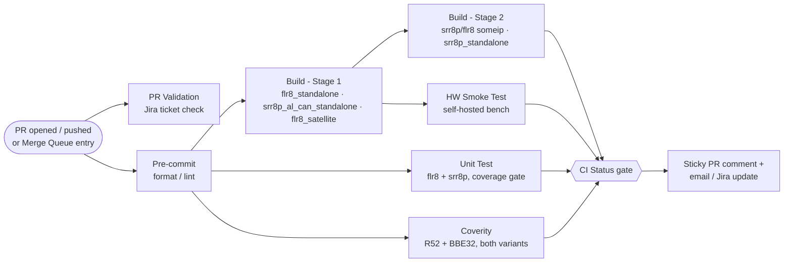

# Gen8 iND13400 Repository

[](https://github.com/pre-commit/pre-commit)

This repository stores the Gen8 code for the indie **iND13400** microcontroller.

**Repository:** <https://aptv.ghe.com/GPO/Core_Radar_Gen8_iND13400>

---

## Table of Contents

| Section | Contents |
| --- | --- |
| [Repository Setup](#repository-setup) | `repo_init.py`, Python requirements, `.netrc` credentials |
| [Git Submodules](#git-submodules) | Submodule list, init helper script, updating, troubleshooting |
| [Hardware Compatibility Matrix](#hardware-compatibility-matrix) | Bootloader / hardware / branch compatibility |
| [Committing Changes and CI Checks](#committing-changes-and-ci-checks) | GitHub Actions pipeline, Verified, Build, Coverity, Unit Test, Smoke Test, Dev vs. Release macros |
| [Building the Gen8 Code](#building-the-gen8-code) | Bazel/Bazelisk, variants, build commands |
| [Conditional Build Flags](#conditional-build-flags) | All optional build flags and their defaults |
| [Build Troubleshooting](#build-troubleshooting) | Long paths, corrupt cache, remote cache |
| [Unit Tests and Coverage](#unit-tests-and-coverage) | GoogleTest, coverage reports |
| [Coverity](#coverity) | Build, analysis, desktop analysis |
| [compile_commands.json for TiCS](#compile_commandsjson-for-tics) | Generating the compilation database |
| [Defining Macros in .bazelrc](#defining-macros-in-bazelrc) | Preprocessor macro syntax |

---

## Repository Setup

### Overview

A script called `repo_init.py` is stored at the base of this repository.
**It should be called each time this repository is cloned.**

### What it does

1. Verifies a compliant version of Python is used and downloads the required Python packages.
2. Installs the required pre-commit hooks for this repository. These are verified via CI.
3. Creates/updates a `.netrc` with the credentials required for building the project (see [.netrc Credentials](#netrc-credentials)).

### Requirements

| Item | Value |
| --- | --- |
| Minimum Python version | 3.7 |
| Recommended Python version | 3.10 (the version the scripts are tested with) |

### How to Run

Open a command prompt and run the following from the root of the repository:

```bash
python repo_init.py
```

### .netrc Credentials

Credentials to various tools are required as part of the build and setup processes. The `.netrc` file is used to provide those credentials to those processes.

`repo_init.py` *may* ask you to provide your username and API key / password to populate the `.netrc` file. This file is stored locally in your machine's Home folder.

> [!TIP]
> Use an **API key** instead of your password — otherwise your raw password is stored in the `.netrc` file on this machine.
> API keys can be generated from the web GUIs of each individual tool. See the [Adv Active Safety SW/SYS Git Gerrit Wiki](https://tinyurl.com/advSysSwGitGerritWikiApi) for instructions.

> [!IMPORTANT]
> You must re-run this script whenever your password updates (once per user, per machine) — unless you use API keys.

**Private registry errors:** private GitHub Enterprise registries return `404 Not Found` when credentials are missing or lack read permission. Bazel reports this as:

```text
module <name>@<version> not found in registries
```

…even when the module exists. If a module is available only from `raw.aptv.ghe.com`, run `python repo_init.py` and verify that the supplied credentials have access to the GPO Bazel registry.

---

## Git Submodules

This repo contains several Git submodules. Functionally, these are nested Git repositories where this (parent) repo keeps track of which commit to check out in the sub (child) repositories. Git does **not** check out or update these child repositories automatically — it must be triggered by the user.

Check the `.gitmodules` file for the full list of currently configured repositories.
All submodules are hosted on Aptiv GitHub Enterprise (`https://aptv.ghe.com/GPO/...`).

| Path | Repository | Tracked branch |
| --- | --- | --- |
| `software/r52/autosar/sip` | [core-radar-gen8-ind13400-sip](https://aptv.ghe.com/GPO/core-radar-gen8-ind13400-sip) | pinned commit |
| `tools/python/testing_framework/Core_Radar_Python_Framework` | [core-radar-python-framework](https://aptv.ghe.com/GPO/core-radar-python-framework) | `dev` |
| `tools/ITF/ExecutableSpecs/ADVRADAR_Gen7_Exec_Spec` | [core-radar-gen7-exec-spec](https://aptv.ghe.com/GPO/core-radar-gen7-exec-spec) | `dev` |
| `tools/ITF/Mex_Executable_Specs/Core_Radar_Gen8_iND13400_Matlab` | [core-radar-gen8-ind13400-matlab](https://aptv.ghe.com/GPO/core-radar-gen8-ind13400-matlab) | `dev` |

### Helper script (recommended)

`tools/init_submodules.ps1` reads `.gitmodules`, lets you pick which submodules you need, and recovers automatically from a dead commit pin or a failed Git LFS download.

Run it from anywhere inside the repository:

```powershell
powershell -NoProfile -ExecutionPolicy Bypass -File tools\init_submodules.ps1
```

With no arguments it prints a numbered menu — enter `1,3`, `a` for all, or `q` to quit.

| Command | What it does |
| --- | --- |
| `... -File tools\init_submodules.ps1` | Interactive menu |
| `... -File tools\init_submodules.ps1 -All` | Initialize every submodule |
| `... -File tools\init_submodules.ps1 -Submodule ADVRADAR_Gen7_Exec_Spec` | Initialize one, matched on any part of the path or name |
| `... -File tools\init_submodules.ps1 -Submodule sip, Matlab` | Initialize several |
| `... -File tools\init_submodules.ps1 -All -Remote` | Ignore the recorded commits and take the tip of each tracked branch |

The script always runs `git submodule sync` first (so a clone made before the GitHub Enterprise migration stops using the old URL) and prints the active remote for each submodule. It exits non-zero if any submodule fails, so it is safe to call from CI.

### Initial clone setup

> [!NOTE]
> None of these submodules are required for the default build — the SIP sources are downloaded from Artifactory by Bazel.
> Initialize only the submodule you need. Run every command below from the **root** of the repository.

<details>
<summary><b>AUTOSAR SIP</b> — <code>software/r52/autosar/sip</code></summary>

```bash
git submodule update --init --progress -- software/r52/autosar/sip
```

Helper batch files also exist in `software/r52/autosar`:

| File | Purpose |
| --- | --- |
| `init_sip_submodule.bat` | Submodule only |
| `init_sip_and_download_generators.bat` | Submodule + generators from Artifactory |

See [software/r52/autosar/README.md](software/r52/autosar/README.md) for details.

</details>

<details>
<summary><b>Python test framework</b> — <code>tools/python/testing_framework/Core_Radar_Python_Framework</code></summary>

```bash
git submodule update --init --progress -- tools/python/testing_framework/Core_Radar_Python_Framework
```

Or run `tools/python/testing_framework/STEP3_Initiate_Python_Automation_Repo.bat`, which additionally cleans local changes and checks out the tracked `dev` branch.

See [tools/python/testing_framework/Python_Framework_README.md](tools/python/testing_framework/Python_Framework_README.md).

</details>

<details>
<summary><b>ITF executable specs</b> — <code>tools/ITF/ExecutableSpecs/ADVRADAR_Gen7_Exec_Spec</code></summary>

```bash
git submodule update --init --progress -- tools/ITF/ExecutableSpecs/ADVRADAR_Gen7_Exec_Spec
```

</details>

<details>
<summary><b>ITF MATLAB executable specs</b> — <code>tools/ITF/Mex_Executable_Specs/Core_Radar_Gen8_iND13400_Matlab</code></summary>

```bash
git submodule update --init --progress -- tools/ITF/Mex_Executable_Specs/Core_Radar_Gen8_iND13400_Matlab
```

</details>

**All submodules at once:**

```bash
git submodule update --init --recursive --progress
```

### Updating submodules

| Goal | Command |
| --- | --- |
| Move an initialized submodule to the commit recorded in this repo (do this after every `git pull`) | `git submodule update --progress -- <submodule path>` |
| Check which commit each submodule is currently on | `git submodule status` |

Pull the latest commit of the branch a submodule tracks (`dev` for the three listed above) and record it in this repo:

```bash
git submodule update --remote --progress -- <submodule path>
git add <submodule path>
git commit -m "Update <submodule path> pointer"
```

### Checking which remote a repo points to

`git remote -v` prints the fetch/push URLs of the repository you are currently in. For this repo it should report:

```console
> git remote -v
origin  https://aptv.ghe.com/GPO/Core_Radar_Gen8_iND13400.git (fetch)
origin  https://aptv.ghe.com/GPO/Core_Radar_Gen8_iND13400.git (push)
```

To print the remote of every initialized submodule at once, run from the repository root:

```bash
git submodule foreach --recursive "git remote -v"
```

`git remote -v` reports the URL your local clone actually uses, which can differ from `.gitmodules` if the URL was changed upstream. To compare against the committed values:

```bash
git config --file .gitmodules --get-regexp url
```

If the two disagree, run `git submodule sync --recursive` to push the `.gitmodules` URLs into your local config.

If a submodule URL changed in `.gitmodules` (for example the Gerrit → GitHub Enterprise migration), refresh your local config before updating:

```bash
git submodule sync --recursive
git submodule update --init --progress -- <submodule path>
```

### Troubleshooting: `not our ref` / "did not contain \<sha\>"

```text
fatal: remote error: upload-pack: not our ref <sha>
fatal: Fetched in submodule path '<path>', but it did not contain <sha>.
```

**Cause:** the commit this repo pins for that submodule does not exist on the remote. This is *not* a URL or credentials problem — `git submodule sync` will not help. It typically happens when a submodule was migrated to a new host and the pinned commit lived on a ref that was not carried over.

**Fix** — move the submodule to the tip of the branch it tracks and commit the new pointer:

```bash
git submodule update --init --remote --progress -- <submodule path>
git add <submodule path>
git commit -m "Repoint <submodule path> to a commit available on GHE"
```

> [!NOTE]
> `Core_Radar_Python_Framework` is configured with `ignore = all`, so `git status` will not report the pointer change — stage it explicitly with `git add`.

`tools/init_submodules.ps1` applies this fallback automatically.

### Troubleshooting: Git LFS `Bad credentials`

```text
Error downloading object: <file> ... batch response: Bad credentials
error: external filter 'git-lfs filter-process' failed
fatal: Unable to checkout '<sha>' in submodule path '<path>'
```

**Cause:** `ADVRADAR_Gen7_Exec_Spec` stores large files in Git LFS. The LFS API needs credentials for `aptv.ghe.com` in your `.netrc`; a plain Git clone can succeed while LFS still fails, because Git itself may be authenticating through a credential helper.

**Fix:** add an `aptv.ghe.com` entry to your `.netrc` (username plus a GHE personal access token), then retry.

To check out the submodule now and fetch the large files later:

```bash
git -c filter.lfs.smudge= -c filter.lfs.process= -c filter.lfs.required=false submodule update --init --progress -- <submodule path>
git -C <submodule path> lfs pull
```

> [!WARNING]
> Until `lfs pull` succeeds, the LFS-tracked files are small text pointer stubs, so any tool reading them will fail or behave oddly.

`tools/init_submodules.ps1` performs this fallback automatically and tells you which submodules still need `lfs pull`.
Authentication uses the credentials in your `.netrc` for `aptv.ghe.com` — see [.netrc Credentials](#netrc-credentials).

### More information

- Official Git documentation: <https://git-scm.com/book/en/v2/Git-Tools-Submodules>
- Command-line options: `git submodule --help`

---

## Hardware Compatibility Matrix

> [!CAUTION]
> Make sure the **correct bootloader** is flashed, otherwise the unit can be bricked.
> Especially for closed units, make sure the right option in the JSON files is used. The file name must match the table below exactly.

| Hardware | Silicon | Bootloader | Supported software |
| :-- | :-- | :-- | :-- |
| **A2.4.1** (non-ADC)<br>**A2.4.2** (ADC) | Chandra B0 ES2.2 (trimmed)<br>Mars B0/B1 ES2.2 (trimmed) | `pbl_merged_chandra_b0_v50a_204.s19` | `dev` after R4.0.5<br>(tag `v4.0.5` or above) |
| **A2.3.1** (non-ADC)<br>**A2.3.2** (ADC) | Chandra B0 ES2.2 (trimmed)<br>Mars B0/B1 ES2.0 (non-trimmed) | `pbl_merged_chandra_b0_v50a_204.s19` | `dev` after R4.0.0 |
| **A2.0.x / A2.1.x**<br>**A2.2.x / A2.3.0** | — | — | ❌ No longer supported |
| **A1** | Chandra A0, Mars A0 | `pbl_merged_v35e.s19` | Tiger1 (`feature/Tiger_Team_Branch`) R1.2.9<br>Tiger2 (`feature/Gen8_Tiger2`) R3.1.119<br>`dev` up to R3.0.0 |
| **EDU** | — | `pbl_merged_v20h.s19` or `pbl_merged_v33a`<br>(depending on SBoot) | Tiger1 (`feature/Tiger_Team_Branch`) R1.2.9<br>`dev` up to R3.0.0 |

**Bootloader locations**

| Hardware | Path |
| :-- | :-- |
| A2.3.x / A2.4.x | `outputs\pbl\chandra_b0\` |
| A1 | `outputs\pbl\chandra_a0\` |
| EDU | `outputs\pbl\edu\` |

### Bootloader compatibility breaks

> [!CAUTION]
> **Do not flash an old bootloader on hardware with the new SBoot — it will brick the module.**

| Hardware | Required bootloader | Release |
| --- | --- | --- |
| A2.4.1 and some A2.3.1/2/3 with new SBoot (`v50a_204`) | V1.6.9 or newer — `pbl_merged_chandra_b0_v50a_204` | R4.0.5 |
| ❌ Incompatible on the above hardware | V1.6.7 or older — `pbl_merged_chandra_b0_v41b` | R4.0.4 and earlier |

### LBIST and BOR — [IR-1576] [IR-1590]

**LBIST**

- Cannot be enabled on A2.3.x due to a short pulse on `Chandra.PMUFAULTB`, which is connected to `PMIC_MCU_ERR`.
- Can be enabled on A2.4.x (with `Chandra.PMU_FAULTB` → `PMIC.MCU_ERR` removed and a pull-up added).
- Is enabled on A2.4.x — except the first 2 units delivered to Revanth: `JXH062` and `JXH079`.

**BOR**

- Needs values from the OTP area, available in Chandra trimmed units (A2.3.x and A2.4.x).
- From release R4.0.5 onwards, trimmed values from the OTP area are used.
- Software before this used default values and could cause issues / resets.

---

## Committing Changes and CI Checks

**Repo:** <https://aptv.ghe.com/GPO/Core_Radar_Gen8_iND13400>

CI runs entirely on **GitHub Actions**. Opening a pull request (or adding your PR to the **merge queue**) triggers [`.github/workflows/quality-checks.yml`](.github/workflows/quality-checks.yml), which fans out into the checks below. Branch protection blocks merging until all required checks pass. A sticky bot comment on your PR is created on the first run and updated in place as each stage completes — read it first before digging into job logs.



If you believe a check failed due to an infrastructure/unknown error, or you need help deciphering the logs, contact the **CICD team**.

| Check | Workflow / job | What it verifies |
| --- | --- | --- |
| [Verified](#verified) | `precommit` | Formatting / pre-commit standards |
| [Build](#build) | `build_stage_1`, `build_stage_2` | Code builds for `flr8` and `srr8p`, across multiple variant flag combinations |
| [Coverity](#coverity-check) | `coverity` (calls [`coverity.yml`](.github/workflows/coverity.yml)) | Static analysis compliance (Coverity High & Medium, MISRA Mandatory & Required) — R52 + BBE32, both variants |
| [Unit Test](#unit-test) | `unit_test` | All unit tests compile, pass, and meet the per-module coverage thresholds |
| [Smoke Test](#smoke-test) | `hw_test` (calls [`smoke-test.yml`](.github/workflows/smoke-test.yml)) | Automated runtime tests pass on real hardware after Stage 1 builds succeed |

> [!NOTE]
> `merge_group` runs are the same checks re-run against the speculative merge-queue commit before your PR actually merges — treat a merge-queue failure the same as a PR failure.

### Dev vs. Release build macros

Two Bazel macros — `--disable_int_wdg` and `--enable_debug` — disable the internal watchdog and FCRU faults 18–21 (which trip when a debugger/Lauterbach is attached). They must **never** ship in an official release build. The table below is the canonical policy (as agreed with the team); the GitHub Actions workflows implement it exactly:

| Sl.No | CICD | Flags | Usage | Pull Request | Merge Q | Push dev | Nightly | Release | SWE6 Test and SW Checkout / Smoke Test (needs Lauterbach) |
| --- | --- | --- | --- | --- | --- | --- | --- | --- | --- |
| 1 | **Development Build Job** | add `--disable_int_wdg` `--enable_debug` | Use for development / with debugger connected use case. **DO NOT use for release.** | ✅ Use this | NA | NA | NA | NA | NA |
| 2 | **Release build Job** *(official release should be with this option)* | **Do not add these flags** | Release and Release Intent testing (Smoke Test, ITV test, Nightly) | NA | ✅ Use this | ✅ Use this | ✅ Use this | ✅ Use this | — |
| 3 | **SWE6 Build Job** | add `--enable_debug` | SWE6 job uses Lauterbach but no stepping/pausing needed. A separate build gives the option to have Int WDG tested, but this keeps FCRU faults enabled. | — | — | — | — | — | ✅ Use this |

> **Info** — `--enable_debug` disables FCRU fault-18 to fault-21, which monitor the debug signal and cause a reset when Lauterbach is connected. `--disable_int_wdg` disables the internal watchdog.

`quality-checks.yml` adds them automatically only for the trigger types that represent an in-development build (row 1); everything that represents a release-track build (row 2) gets a clean, unmodified build. Mapped to the actual GitHub event names:

| Trigger | Job (from table above) | Dev macros (`--disable_int_wdg --enable_debug`) |
| --- | --- | --- |
| `pull_request` | Development Build Job | ✅ added |
| `workflow_dispatch` (manual run, diffed like a PR) | Development Build Job | ✅ added |
| `merge_group` | Release build Job | ❌ not added |
| `push` to `dev` or `release/**` | Release build Job | ❌ not added |
| `schedule` (nightly) | Release build Job | ❌ not added |

The resolved Bazel command (and which row applied) is written to each `Build (Stage 1)` / `Build (Stage 2)` job's **Summary** tab — check there first if a build behaves unexpectedly with/without a debugger attached.

The same policy — plus a third **Release** mode that force-skips the macros regardless of trigger (`Is_Release_Build` input) — is used by [`build-all.yml`](.github/workflows/build-all.yml), the nightly/on-demand workflow that builds every production variant (and optionally SIT/CORE0/ALIGNMENT and `emblib`) and can dispatch the SWE6 test suites once the build completes (SWE6 Build Job, row 3 — `--enable_debug` only).

### Verified

This checks that changes follow the formatting standards identified by a team of your peers, guided by Aptiv's coding standards.

When committing your changes, a set of scripts runs (installed by running `repo_init.py` above) which should automatically format your code, and fix/flag some potential problems. These checks are then run again as part of the **Pre-commit** GitHub Actions job to ensure that you have the pre-commit checks in place. This removes the unnecessary burden on developers to format their code in a standard way, and makes sure all our code is formatted the same way.

If your change fails the "Verified" check, there are 2 potential issues:

1. Your code did not pass all the pre-commit checks.
2. An unknown error occurred and the CICD team needs to check what happened.

For the first option it is your job to fix the issues — the job log shows the exact diff, and (on same-repo PRs) adding the label `auto-fix-pre-commit` makes the bot commit the fix for you automatically. If you have code that you think should *not* be required to follow the autoformatting standards, reach out to the CICD team — they can determine if it is a valid request and assist in excluding the files.

### Build

This verifies that the code is buildable across a representative set of variant/flag combinations (split into **Stage 1** and **Stage 2** for faster feedback — Stage 2 only runs after Stage 1 passes).

If your change fails the "Build" check, there are 2 potential issues:

1. Your code did not build for one of the variants.
2. An unknown error occurred and the CICD team needs to check what happened.

For the first option it is your job to fix the issues. Open the failing job's log from the sticky PR comment or the **Actions** tab — the exact Bazel command used (including any dev macros, see [above](#dev-vs-release-build-macros)) is printed at the top of the log and in the job Summary.

#### CI build matrix (exact commands)

Every CI build ultimately runs:

```bash
bazelisk build //:gen8 --config={flr8|srr8p} {bazel_extra_flags} [--disable_int_wdg --enable_debug] --build_event_json_file=build_event.json
```

`{bazel_extra_flags}` comes from the matrix entry below; the `--disable_int_wdg --enable_debug` pair is appended only per the [Dev vs. Release build macros](#dev-vs-release-build-macros) table.

**PR / merge-queue build (`quality-checks.yml`)**

| Stage | Name | `--config` | `bazel_extra_flags` |
| --- | --- | --- | --- |
| 1 | `flr8_standalone` | `flr8` | `--tracker_variant=platform_flr8_standalone --veh_com=can_standalone` |
| 1 | `srr8p_al_can_standalone` | `srr8p` | `--veh_com=al_can_standalone --tracker_variant=AL --enable_features=true` |
| 1 | `flr8_satellite` | `flr8` | *(none — default `--veh_com=can`)* |
| 2 *(after Stage 1 passes)* | `srr8p_satellite_someip` | `srr8p` | `--veh_com=someip` |
| 2 | `flr8_satellite_someip` | `flr8` | `--veh_com=someip` |
| 2 | `srr8p_standalone` | `srr8p` | `--tracker_variant=platform_srr8p_standalone --veh_com=can_standalone` |

**Nightly / on-demand full build (`build-all.yml`, all run in parallel)**

| Name | `--config` | `bazel_extra_flags` |
| --- | --- | --- |
| `flr8_satellite` | `flr8` | *(none — default `--veh_com=can`)* |
| `srr8p_satellite` | `srr8p` | *(none — default `--veh_com=can`)* |
| `srr8p_al_can_standalone` | `srr8p` | `--veh_com=al_can_standalone --tracker_variant=AL --chandra_hw_rev=B0 --mars_hw_rev=B0 --enable_features=true` |
| `flr8_standalone` | `flr8` | `--tracker_variant=platform_flr8_standalone --veh_com=can_standalone` |
| `srr8p_standalone` | `srr8p` | `--tracker_variant=platform_srr8p_standalone --veh_com=can_standalone` |
| `flr8_satellite_someip` | `flr8` | `--veh_com=someip` |
| `srr8p_satellite_someip` | `srr8p` | `--veh_com=someip` |

> [!TIP]
> Both workflows print the fully resolved command (matrix flags + dev macros, in shell-quoted form) at the top of every build job's log **and** in that job's Summary tab — treat that as the source of truth over this table if the two ever disagree.

#### Aptiv Official Release

```text
--Aptiv_Official_Release       : All Det Errors will be filtered
```

### Coverity check

This verifies that the code is static-analysis compliant for the default build configuration for *each* variant. Core Radar has specified a set of rules to check against (Coverity High & Medium, MISRA Mandatory & Required). If your C code is not compliant you will get a failing Coverity check and will need to fix the issues written back in the review comments.

If your change fails the "Coverity" check, there are 3 potential issues:

1. Your code did not build for one of the variants.
2. Your code does not meet the static analysis standards.
3. An unknown error occurred and the CICD team needs to check what happened.

For the first or second option it is your job to fix the issues. The job logs (linked from the sticky PR comment) can assist you.

### Unit Test

This verifies that all unit tests compile and pass, and that coverage meets the thresholds enforced by `//coverage:report`.

If your change fails the "Unit-Test" check, there are 2 potential issues:

1. Some of the unit tests are either not passing, not compiling successfully, or coverage dropped below the required threshold.
2. An unknown error occurred and the CICD team needs to check what happened.

For the first option it is your job to fix the issues. The job log and uploaded coverage artifacts can assist you.

### Smoke Test

This verifies that some automated runtime tests pass as expected on real hardware, using the `flr8_standalone` and `srr8p_al_can_standalone` artifacts produced by Stage 1.

If your change fails the "Smoke-Test" check, there are 2 potential issues:

1. Some of the smoke tests are failing.
2. An unknown error occurred and the CICD team needs to check what happened.

For the first option it is your job to fix the issues. The job log can assist you, and a comment with a link to the job is written back to your PR.

---

## Building the Gen8 Code

### Bazel

Bazel is used to build the code. **Bazelisk** is a wrapper around Bazel that ensures we all use the same Bazel version.

Bazel is a very powerful build tool and has many functionalities that may benefit the software development process (dependency maps, build trees, etc.).

| Resource | Link |
| --- | --- |
| Bazel documentation | <https://bazel.build> |
| Bzlmod — Bazel's dependency management system | <https://bazel.build/versions/7.5.0/external/module> |
| Recorded live Bazel demonstration | [Microsoft Stream channel](https://web.microsoftstream.com/embed/channel/04ec5a53-afff-4221-ba76-0a7d0dd50ed6?app=microsoftteams&sort=undefined&l=en-us#) |

If you do not have access to the Stream link, request access to the *Adv Active Safety SW/SYS* team in Microsoft Teams.

### Before you build

> [!NOTE]
> **Note 1 — supported hardware.** EDU and A1 hardware with Chandra A0 are no longer supported on the `dev` branch; use the `feature/Gen8_Tiger2` branch instead.
> The `dev` branch and `release/v4.0.x` onwards support A2.x hardware with Chandra B0 and Mars B0/B1. The steps below build the Gen8 code for A2.x hardware (Chandra B0 + Mars B0/B1).

> [!NOTE]
> **Note 2 — watchdog.** The internal watchdog is enabled on the `dev` branch. Add the build option `--disable_int_wdg` for debugging.

| Flag | Default | Notes |
| --- | --- | --- |
| `--chandra_hw_rev` | `B0` | Board version; default is also `B0` for CICD (`software/r52/BUILD`) |
| `--mars_hw_rev` | `B0` | Use `B0` or `A0` based on hardware. Mars `A0` is no longer supported/tested |

**All commands must be run from the root of the repository.**

### Cleaning

```bash
# Clean old build files
bazelisk clean

# Deep clean - deletes the entire outputBase directory
bazelisk clean --expunge
```

### Variants and variant-specific build commands

| # | Variant | CAN | SOMEIP | Tracker |
| --- | --- | :---: | :---: | :---: |
| 1 | [Satellite-CAN (default)](#1-satellite-can--default) | ✅ | ❌ | ❌ |
| 2 | [Satellite-Eth_Someip_HighDet](#2-satellite-eth_someip_highdet) | ❌ | ✅ | ❌ |
| 3 | [Standalone (CAN enabled, SOMEIP disabled)](#3-standalone--can-enabled-someip-disabled) | ✅ | ❌ | ✅ |
| 4 | [AL SRR8P Standalone](#4-al-srr8p-specific--standalone-with-can-enabled) | ✅ | ❌ | ✅ (Fusion) |

#### 1. Satellite-CAN / default

CAN present, no SOMEIP, no tracker.

```bash
# FLR8
bazelisk build //:gen8 --config=flr8 --veh_com=can --chandra_hw_rev=B0 --mars_hw_rev=B0
# SRR8P
bazelisk build //:gen8 --config=srr8p --veh_com=can --chandra_hw_rev=B0 --mars_hw_rev=B0
```

…or, relying on the defaults:

```bash
# FLR8
bazelisk build //:gen8 --config=flr8
# SRR8P
bazelisk build //:gen8 --config=srr8p
```

#### 2. Satellite-Eth_Someip_HighDet

No CAN, SOMEIP present, no tracker, high-det SMC, AF 2048 dets, SOMEIP 400 dets based on ARXML.

```bash
# FLR8
bazelisk build //:gen8 --config=flr8 --veh_com=someip --chandra_hw_rev=B0 --mars_hw_rev=B0
# SRR8P
bazelisk build //:gen8 --config=srr8p --veh_com=someip --chandra_hw_rev=B0 --mars_hw_rev=B0
```

> [!NOTE]
> For the SOMEIP build variant, the SMC with high detection count is integrated (from the Tiger branch).

#### 3. Standalone — CAN enabled, SOMEIP disabled

CAN present, no SOMEIP, tracker present.

```bash
# FLR8
bazelisk build //:gen8 --config=flr8 --veh_com=can_standalone --tracker_variant=platform_flr8_standalone --chandra_hw_rev=B0 --mars_hw_rev=B0
# SRR8P
bazelisk build //:gen8 --config=srr8p --veh_com=can_standalone --tracker_variant=platform_srr8p_standalone --chandra_hw_rev=B0 --mars_hw_rev=B0
```

#### 4. AL SRR8P specific — standalone with CAN enabled

CAN enabled, Fusion tracker present, default CAN TSYNC, no SOMEIP, features enabled.

```bash
# SRR8P
bazelisk build //:gen8 --config=srr8p --veh_com=al_can_standalone --tracker_variant=AL --chandra_hw_rev=B0 --mars_hw_rev=B0 --enable_features=true
```

### Additional / debug build commands

**Override a repository with a local checkout:**

```bash
bazelisk build //:gen8 --override_repository=_main~_repo_rules~spbb="absolute\path\in\local\machine"
```

**Build with the test pattern generator:**

```bash
bazelisk build //:gen8 --config=use_test_pattern_gen
```

> [!NOTE]
> Run this with `MemAccess` in Trace32 set to *Denied* and all breakpoints disabled.

**Test IDM and DC compensation** — build with ADC logging capability and the Mars pattern generator.
Enable IDM and disable IDM from `mipi_ifc.c`, run this build, then check that the DC offset is gone and inspect the IDM stats:

```bash
bazelisk build //:gen8 --@bb_cfg//:enable_adc_logging=True --config=configure_MARS_test_pattern --override_repository=_main~_repo_rules~spbb="C:\Users\mjc2z6\git_repos\g8_bb_clean_nextCI\Core_Radar_Gen8_iND13400_Signal_Processing"
```

**Test range processing with the test pattern generator** so that the logged ADC data can be plotted:

```bash
bazelisk build //:gen8 --config=use_test_pattern_gen --@bb_cfg//:enable_adc_logging=True
```

> [!NOTE]
> Run this with `MemAccess` in Trace32 set to *Denied* and all breakpoints disabled.

Then change `xcp_log_chirp_num` to anything between `0` and `1019`:

```text
Var.set XCP_AdcData_Buffer.log_adc_command.xcp_log_chirp_num = 1019
Var.draw XCP_AdcData_Buffer.xcp_adc_data_log
```

### Versioning

Several of the conditional builds are captured as part of software versioning in the `versions.c` file. See [GPO Radar Software Versioning](https://confluence.asux.aptiv.com/display/AASSA/GPO+Radar+Software+Versioning) for more information.

---

## Conditional Build Flags

Our builds have optional conditional builds to enable/disable certain parts of the code. While production-intent configurations should be done with the *variant* flags, these other conditional builds are used for debugging/testing. The flags below can be added to the command line to build with them.

> [!NOTE]
> Short and long forms of conditional builds are defined in `.bazelrc` as `flag_alias` configurations.
> Only **one** form of the flag needs to be given on the command line.

### Flag quick reference

| Flag | Default | Purpose |
| --- | --- | --- |
| [`--veh_com`](#someip-and-can-modules-as-vehicle-communication) | `can` | Vehicle communication module selection |
| [`--tracker_variant`](#tracker-variant-selection) | `disabled` | Tracker variant selection |
| [`--stub_tracker`](#tracker-stub) | `false` | Tracker stub with synthetic det data |
| [`--enable_features`](#feature-functions) | `false` | Feature functions |
| [`--@build_config//:asic_fpga` / `--bbe_asic_fpga`](#fpga-vs-asic-configuration) | `asic` | FPGA vs ASIC configuration |
| [`--@bb_cfg//:enable_adc_logging`](#xcp-adc-logging) | `False` | XCP ADC logging |
| [`--enable_transpose_cfar`](#transpose-cfar) | — | Transpose CFAR in SPBB config |
| [`--enable_cdc`](#cdc-logging) | `false` | CDC logging |
| [`--//software/bbe32/src:enable_chirp_timing` / `--enable_chirp_profiling`](#chirp-timing-output) | — | Chirp timing output |
| [`--enable_stream_generation`](#stream-re-generation-with-resim-supported-files) | `False` | Stream re-generation |
| [`--disable_all_logging_streams_tx`](#stream-transmission) | `false` | Disable all (UDP+CDC) stream TX |
| [`--disable_udp_logging_streams_tx`](#stream-transmission) | `false` | Disable UDP stream TX |
| [`--enable_stream_rx`](#stream-rx-vid_stream) | `true` | Streams RX callback |
| [`--enable_uart`](#mcal-uart-module) | `False` | MCAL UART module |
| [`--enable_phy_100Mb`](#ethernet-phy-configuration-100mb) | off (1Gb) | Configure Ethernet PHY for 100Mb |
| [`--static_register_safety_enabled`](#static-register-safety) | `true` | Static register safety monitoring |
| [`--disable_stack_monitor_r52`](#stack-monitoring-r52) | enabled | Runtime stack monitoring |
| [`--disable_pfm`](#program-flow-monitor-pfm) | enabled | Program flow monitoring |
| [`--enable_sqt_artiemem`](#sqt-artiemem-fault-stubs) | `False` | RAM ECC fault-injection SQT test cases |
| [`--Integration_Testing`](#swe5-integration-testing-sit) | `false` | SWE5 integration testing framework |
| [`--enable_debug`](#debug-enable) | off | Disable FCRU faults 18–21 while debugging |
| [`--disable_int_wdg`](#before-you-build) | off | Disable internal watchdog for debugging |
| [`--chandra_hw_rev` / `--mars_hw_rev`](#before-you-build) | `B0` | Hardware revisions |
| [`--noremote_accept_cached`](#corrupt-remote-cache) | off | Ignore a possibly corrupt remote cache |

### Tracker variant selection

Use `--tracker_variant=<value>` to control tracker variant selection and disabling.

| Value | Meaning |
| --- | --- |
| `disabled` | Disable tracker code from building |
| `partner_sensor` | Disable tracker code from building, enable code for partner sensor data transmission |
| `platform_flr8_standalone` | `PLATFORM_FLR8_STANDALONE` (F360 variant G → 1 MRR sensor, 128 detections, 64/50 objects) |
| `platform_srr8p_standalone` | `PLATFORM_SRR8P_STANDALONE` (variant J → 1 SRR sensor, 128 detections, 64/64 objects) |
| `platform_srr8p_2_sensor_fusion` | `PLATFORM_SRR8P_2_SENSOR_FUSION` (variant R → 2 SRR sensors, 64 detections each, 64/64 objects) |
| `AL` | `AL_TRACKER` (variant R → 2 SRR sensors, 64 detections each, 64/64 objects) |

**Examples:**

```bash
bazelisk build //:gen8 --config=flr8  --veh_com={placeholder}      --tracker_variant=disabled                       --chandra_hw_rev=B0 --mars_hw_rev=B0
bazelisk build //:gen8 --config=flr8  --veh_com={placeholder}      --tracker_variant=partner_sensor                 --chandra_hw_rev=B0 --mars_hw_rev=B0
bazelisk build //:gen8 --config=flr8  --veh_com=can_standalone     --tracker_variant=platform_flr8_standalone       --chandra_hw_rev=B0 --mars_hw_rev=B0
bazelisk build //:gen8 --config=srr8p --veh_com=can_standalone     --tracker_variant=platform_srr8p_standalone      --chandra_hw_rev=B0 --mars_hw_rev=B0
bazelisk build //:gen8 --config=srr8p --veh_com=can_standalone     --tracker_variant=platform_srr8p_2_sensor_fusion --chandra_hw_rev=B0 --mars_hw_rev=B0
bazelisk build //:gen8 --config=srr8p --veh_com=al_can_standalone  --tracker_variant=AL                             --chandra_hw_rev=B0 --mars_hw_rev=B0
```

### Tracker stub

Use `--stub_tracker=true` to enable stub code for creating objects with synthetic det data. It should be enabled together with the tracker option (`--tracker_variant=<value>`).

> [!NOTE]
> By default the tracker stub is disabled.

### Feature functions

Use `--enable_features=true` to enable the feature functions while building.

> [!NOTE]
> By default the feature function code is disabled from building.

**Examples:**

```bash
bazelisk build //:gen8 --config=flr8  --veh_com=none             --tracker_variant=platform_flr8_standalone  --enable_features=true
bazelisk build //:gen8 --config=srr8p --veh_com=none             --tracker_variant=platform_srr8p_standalone --enable_features=true
bazelisk build //:gen8 --config=srr8p --veh_com=al_can_standalone --tracker_variant=AL                       --enable_features=true
```

### SomeIp and CAN modules as vehicle communication

By default CAN is enabled and SOMEIP is disabled. The tracker is disabled by default.

| Goal | Flags |
| --- | --- |
| Enable SOMEIP | `--veh_com=someip` |
| Enable CAN (optional, it is the default) | `--veh_com=can` |
| Disable CAN and SOMEIP | `--veh_com=none` (needed to compile/build for the tracker) |
| Enable ROT tracker | `--veh_com=none --tracker_variant=platform_flr8_standalone` (or another `tracker_variant` option) |

> [!IMPORTANT]
> At the moment either CAN **or** SOMEIP can be enabled, due to memory space constraints.

### FPGA vs ASIC configuration

Sets the option for FPGA or ASIC configurations. The default selection is the ASIC configuration. This option is specifically added for the BBE configuration.

```text
--@build_config//:asic_fpga=fpga
--@build_config//:asic_fpga=asic
--bbe_asic_fpga=fpga
--bbe_asic_fpga=asic
```

### XCP ADC logging

Enable/disable the ADC logging of a chirp of data to system memory for XCP consumption. The default selection is disabled.

```text
--@bb_cfg//:enable_adc_logging=True
--@bb_cfg//:enable_adc_logging=False
```

### Transpose CFAR

Enable/disable transpose CFAR support in the SPBB configuration.

```text
--enable_transpose_cfar=True
--enable_transpose_cfar=False
```

### CDC logging

Enable/disable CDC logging. Default is `false`.

```text
--enable_cdc=True
```

### Chirp timing output

Enable/disable the logging of the timing related to chirp processing. Includes the first chirp timing, the max of the intermediate chirps, and the last chirp timing information.

```text
--//software/bbe32/src:enable_chirp_timing=True
--//software/bbe32/src:enable_chirp_timing=False

--enable_chirp_profiling=True
--enable_chirp_profiling=False
```

### Stream re-generation with RESIM supported files

```text
--enable_stream_generation          : enable stream generation
--enable_stream_generation=True     : enable stream generation
--enable_stream_generation=False    : disable stream generation
```

By default stream re-generation is **disabled**.

### Stream transmission

```text
--disable_all_logging_streams_tx          : disable all(UDP+CDC) streams transmission
--disable_all_logging_streams_tx=true     : disable all(UDP+CDC) streams transmission
--disable_all_logging_streams_tx=false    : enable all(UDP+CDC) streams transmission (default)

--disable_udp_logging_streams_tx          : disable UDP streams transmission
--disable_udp_logging_streams_tx=true     : disable UDP streams transmission
--disable_udp_logging_streams_tx=false    : enable all(UDP+CDC) streams transmission (default)
```

By default `disable_all_logging_streams_tx` and `disable_udp_logging_streams_tx` are `false`.

### Stream RX (VID_STREAM)

```text
--enable_stream_rx         : enable streams rx callback
--enable_stream_rx=true    : enable streams rx callback
--enable_stream_rx=false   : disable streams rx callback
```

By default `stream_rx_enable` is `true`.

### MCAL UART module

Enable/disable the MCAL UART. By default the UART module is **disabled**.

```text
--enable_uart=True
```

### Ethernet PHY configuration (100Mb)

Configures the Ethernet PHY to 100Mb. By default the **1Gb** PHY is configured.

```text
--enable_phy_100Mb
```

Variants currently supported with the 100Mb PHY:

| Variant | Configuration |
| --- | --- |
| FLR8 | Satellite CAN |
| SRR8P | Satellite CAN |

> [!NOTE]
> In DaVinci Configurator the 1Gb PHY configuration is selected by default. The build system selects and compiles the appropriate PHY configuration based on the `--enable_phy_100Mb` flag:
>
> | PHY | Generated configuration path |
> | --- | --- |
> | 1Gb | `software/r52/autosar/config/Appl/GenData/PHY_1Gb` |
> | 100Mb | `software/r52/autosar/config/Appl/GenData/PHY_100Mb` |

The ECUC ARXML configuration for the default 1Gb PHY setup lives in `software/r52/autosar/config/Config/ECUC`:

- `Gen8_iND13400_Eth_Eth_ecuc.arxml`
- `Gen8_iND13400_Eth_Eth_Indie_ecuc.arxml`
- `Gen8_iND13400_EthIf_EthIf_ecuc.arxml`

To regenerate the configuration for a 100Mb PHY:

1. Copy the corresponding ARXML files from `software/r52/autosar/config/Appl/GenData/PHY_100Mb` to `software/r52/autosar/config/Config/ECUC`.
2. Regenerate the AUTOSAR configuration using DaVinci Configurator.
3. After code generation, the following files are created in the `GenData` directory:

   ```text
   Eth_Cfg.h
   EthIf_GenTypes.h
   TcpIp_Lcfg.h
   Eth_PBcfg.c
   EthIf_Lcfg.c
   TcpIp_Lcfg.c
   ```

4. Move the generated files into the PHY-specific folder matching the build configuration — `PHY_1Gb` for 1Gb builds, `PHY_100Mb` for 100Mb builds.

> [!IMPORTANT]
> Ensure the generated configuration files match the PHY type being built. A mismatch between the selected build flag and the generated PHY configuration files may result in incorrect Ethernet initialization or runtime communication issues.

### Static register safety

Enable/disable static register safety monitoring. By default this feature is **enabled**.

```text
--static_register_safety_enabled=false
```

### Enable RDU API exposure for testing purpose
Expose RDU internal APIs from the public headers when needed for testing. By default this is disabled.
```
--enable_rdu_testing=True # to enable API exposure for testing
--enable_rdu_testing=False # to disable API exposure (default)
```

### Enable RDU development guard
Enable/disable RDU development integration using a dedicated build flag. By default this is disabled.

This flag controls RDU-related build wiring and compile-time guards (for example `ENABLE_RDU_DEV`) in
targets that conditionally include RDU dependencies and stream/linker integration.

```
--enable_rdu_dev=True   # enable RDU development path
--enable_rdu_dev=False  # disable RDU development path (default)
```

Recommended one-switch config when RDU dev must be built with CAN mode:

```
--config=rdu_dev_can  # expands to --enable_rdu_dev=true --veh_com=can
```

Notes:
- `--enable_rdu_dev` is for enabling RDU development code paths in guarded targets.
- `--enable_rdu_testing` is a separate flag used for RDU API exposure in testing scenarios.

## Building SIL (Software-in-Loop) Test Binaries

### RDD SIL

Builds the RDD SIL test binary. RDU integration is optional and controlled by `--config=rdu_dev_can`.

# Without RDU (default - RDU code excluded at compile time)
bazelisk build //sil/rsp_sil/main/rsp_wrapper_interface/rdd_sil_interface/test:rdd_sil_Test --variant=flr8
bazelisk build //sil/rsp_sil/main/rsp_wrapper_interface/rdd_sil_interface/test:rdd_sil_Test --variant=srr8p

# With RDU (enables ENABLE_RDU_DEV and links RDU SIL library)
bazelisk build //sil/rsp_sil/main/rsp_wrapper_interface/rdd_sil_interface/test:rdd_sil_Test --variant=flr8 --config=rdu_dev_can
bazelisk build //sil/rsp_sil/main/rsp_wrapper_interface/rdd_sil_interface/test:rdd_sil_Test --variant=srr8p --config=rdu_dev_can


### RDU SIL

Builds the standalone RDU SIL test binary (always requires `--config=rdu_dev_can`).

bazelisk build //sil/rsp_sil/main/rsp_wrapper_interface/rdu_sil_interface/test:rdu_sil_Test --variant=flr8 --config=rdu_dev_can
bazelisk build //sil/rsp_sil/main/rsp_wrapper_interface/rdu_sil_interface/test:rdu_sil_Test --variant=srr8p --config=rdu_dev_can

Note: `--config=rdu_dev_can` expands to `--enable_rdu_dev=true --veh_com=can`.

### Stack monitoring (R52)

Disable runtime stack monitoring. By default stack monitoring is **ENABLED**.

```text
--disable_stack_monitor_r52
--//software/r52/r52_stack:disable_stack_monitor_r52
```

### Program Flow Monitor (PFM)

Disable program flow monitoring. By default PFM is **ENABLED**. When disabled, PFM bypasses all flow-checking logic and sets a no-error status.

```text
--disable_pfm
--//software/r52/program_flow_monitor:disable_pfm
```

### SQT Artiemem fault stubs

Enables the RAM memories ECC fault-injection "SQT testcase" code paths.

```text
--enable_sqt_artiemem=True
--enable_sqt_artiemem=False
```

### Debug enable

```
--Integration_Testing=true          : Enable base Integration Testing framework
--AF_IT=true              : Enable Angle Finding specific interfaces (optional)
--RC_IT=true          : Enable Radar Capability specific interfaces (optional)
--FP_IT=true                 : Enable First pass specific interfaces (optional)
--TOI_IT=true                : Enable TOI (Tracker Object Interface) specific interfaces (optional)
Disables FCRU fault-18 to fault-21, which monitor the debug signal and cause a reset when Lauterbach is connected.

```text
--enable_debug
```

### SWE5 Integration Testing (SIT)

Enables the SWE5 Integration Testing framework for validating data flow between radar processing modules. This feature allows debugger-controlled stubbing and validation of interfaces between the R52 and BBE32 cores.

| Flag | Purpose |
| --- | --- |
| `--Integration_Testing=true` | Enable the base Integration Testing framework |
| `--AF_IT=true` | Enable Angle Finding specific interfaces (optional) |
| `--RC_IT=true` | Enable Radar Capability specific interfaces (optional) |
| `--FP_IT=true` | Enable First Pass specific interfaces (optional) |

**Build examples:**

```bash
# Basic Integration Testing build
bazelisk build //:gen8 --config=flr8 --Integration_Testing=true

# Full Integration Testing with Angle Finding support
bazelisk build //:gen8 --config=flr8 --Integration_Testing=true --AF_IT=true

# Full Integration Testing with Radar Capability support
bazelisk build //:gen8 --config=flr8 --Integration_Testing=true --RC_IT=true

# Full Integration Testing with First pass support
bazelisk build //:gen8 --config=flr8 --Integration_Testing=true --FP_IT=true

# Full Integration Testing with TOI support
bazelisk build //:gen8 --config=flr8 --Integration_Testing=true --TOI_IT=true
```

**Features:**

- Stub injection at Provider points (known test values)
- Validation at Receiver points (verify expected values)
- IPC verification between R52 ↔ BBE32
- Debugger-visible global pointers for test data inspection
- USC calibration interface validation (with Anglefinding_IT)
- SMC/blockage interface validation (with TOI_IT)
- USC calibration interface validation (with `Anglefinding_IT`)

**Reference:** see `.copilot/SWE5_Framework_Reference.md` for complete framework documentation.

---

## Build Troubleshooting

### Long path issues

Long path name issues are observed on some PCs. Create a `user.bazelrc` and specify a shorter output path:

```text
startup --output_base=C:/bzl
```

### Corrupt remote cache

A corrupt remote cache can cause errors on some builds while the same repo works in CI or on other PCs. Add the flag below to skip the (possibly corrupt) cache:

```bash
bazelisk build //:gen8 --config=flr8 --noremote_accept_cached
```

### Remote cache (to speed up build time)

How to connect to the remote cache:

- Brown, Tim D: *Bazel Remote Cache Upgrade* — [Global Radar Perception Systems (GPO-radar) › Bazel, Microsoft Teams](https://teams.microsoft.com/l/message/19:fdc914d6c62e4a498cdf8e65d14d0706@thread.tacv2/1727788365378?tenantId=6b1311e5-123f-49db-acdf-8847c2d00bed&groupId=0770ce58-ec86-4953-9ed1-e67c7fc7603f&parentMessageId=1727788365378&teamName=Global%20Radar%20Perception%20Systems%20(GPO-radar)&channelName=Bazel&createdTime=1727788365378)
- Or: <https://confluence.asux.aptiv.com/x/pnxhJQ>

---

## Unit Tests and Coverage

Unit tests use the **GoogleTest** framework. Run all commands from the root directory of the repository.

### Running unit tests

| Goal | Command |
| --- | --- |
| Build and run **all** unit tests in the `all_unit_tests` test suite | `bazelisk test //:all_unit_tests --test_output=all` |
| Build and run all unit tests in the `tests_bbe` test suite | `bazelisk test //:tests_bbe` |
| Target a single unit | `bazelisk test //software/app/common/test:version_unit_test --test_output=all` |
| Run the unit tests of a single component (example: `SWC_PLT_Appl_IoHwAb`) | `bazelisk test //software/r52/autosar/swc/PLT_SWC/SWC_PLT_Appl_IoHwAb/test:iohwab_adc_appl_unit_test --test_output=all` |

> [!TIP]
> Bazel is a very good incremental build tool, so cleaning should not be necessary. If you do want to clean out the build cache, run `bazelisk clean`.

### Generating coverage reports

> [!WARNING]
> **Windows long path issue.** Windows runs into long path issues with coverage reports. Create a `user.bazelrc` file in the root of the repo and add these lines:
>
> ```text
> startup --output_base=C:/bzl
> test:windows --@bazel_platform//quality/ut:tmp_dir=C:/tmp
> ```
>
> The exact paths do not matter — the goal is to make them as short as possible.

It is not required to run the tests before generating coverage. Any of these commands will tell you where they put their build output in the console log.

| Goal | Command |
| --- | --- |
| Report for **all** unit tests listed in the `coverage_summary` build target named `coverage` | `bazelisk test //coverage:report` |
| Coverage for an individual target | `bazelisk test //coverage:versions` |

Check the `coverage/BUILD` file for the list of all coverage targets, and the respective thresholds for passing in CI.

---

## Coverity

### Coverity build with Bazel

`bazel_platform` provides a few rules to use Coverity within Bazel, specifically `coverity_analysis`.

**R52** — choose one of:

```bash
bazelisk build //software/r52:windriver_r52_cov --variant=flr8
bazelisk build //software/r52:windriver_r52_cov --variant=srr8p
```

**BBE32** — choose one of:

```bash
bazelisk build //software/bbe32:xtensa_bbe32_cov --variant=flr8
bazelisk build //software/bbe32:xtensa_bbe32_cov --variant=srr8p
```

### Coverity analysis with Bazel

Once the build is complete, a local analysis can be run and compared against the latest snapshot on the server to determine if there are any new local Coverity defects.

```bash
bazelisk run //software/r52:commit_defects   --variant=flr8  -- --auth-key-file="C:\Users\(your username)\coverity.auth"
bazelisk run //software/r52:commit_defects   --variant=srr8p -- --auth-key-file="C:\Users\(your username)\coverity.auth"
bazelisk run //software/bbe32:commit_defects --variant=flr8  -- --auth-key-file="C:\Users\(your username)\coverity.auth"
bazelisk run //software/bbe32:commit_defects --variant=srr8p -- --auth-key-file="C:\Users\(your username)\coverity.auth"
```

An auth key can be generated from your user account in [Coverity Connect](https://coverity.asux.aptiv.com/).

### Desktop analysis

See [Coverity Desktop Analysis](https://confluence.asux.aptiv.com/spaces/ADVAS/pages/103473854/Coverity+Desktop+Analysis) for hints on setting up Coverity to run in Eclipse.

> [!NOTE]
> That is an older page and some adaptations will surely be needed for Coverity 2023.6.0. It may be possible to get a Coverity plugin running in Visual Studio Code using similar steps.

Alternatively, use `cov-format-errors` to generate an HTML report which shows the Coverity defects inline with the code. This is similar to, but somewhat inferior to, Coverity Connect or the Eclipse plugin.

The commands below are examples for a BBE32 build on Linux. They may require some adaptation for your system and configuration.

**1. Run the Coverity build above** (e.g. `//software/bbe32:xtensa_bbe32_cov`).

**2. Prepare the output path for the tool:**

```bash
cp -R tools/coverity/xsl bazel-Core_Radar_Gen8_iND13400/external/coverity_2023_6_0_linux/
chmod -R a+w ./bazel-out/k8-fastbuild/bin/software/bbe32/xtensa_bbe32_cov/analysis_combined
./bazel-Core_Radar_Gen8_iND13400/external/coverity_2023_6_0_linux/bin/cov-manage-emit --dir ./bazel-out/k8-fastbuild/bin/software/bbe32/xtensa_bbe32_cov/analysis_combined reset-host-name
```

**3. Invoke the tool:**

```bash
./bazel-Core_Radar_Gen8_iND13400/external/coverity_2023_6_0_linux/bin/cov-format-errors --dir ./bazel-out/k8-fastbuild/bin/software/bbe32/xtensa_bbe32_cov/analysis_combined --html-output covhtml --output-tag _combined --file "external/afbb/module/_common/radar_math/_src/rm_int_to_float.c"
```

The output will be in `covhtml/`; you can choose a different directory if you like.
The `--file` parameter is optional, but without it you probably will not get anything from the external repos.

---

## compile_commands.json for TiCS

TiCS expects a `compile_commands.json` in the main workspace during analysis. Generate it from the root directory of the repository:

```bash
bazel run //:compiledb
```

---

## Defining Macros in .bazelrc

You can define preprocessor macros for C and C++ compilation by adding flags to your `.bazelrc`.

### 1. Define a macro (no explicit value)

```text
build --conlyopt=-D<MACRO>      (ex: build --conlyopt=-DTEST_VALUES)
build --cxxopt=-D<MACRO>        (ex: build --cxxopt=-DTEST_VALUES)
build --define=<MACRO>=         (ex: build --define=TEST_VALUES=)
```

### 2. Define a macro with a value

```text
build --conlyopt=-D<MACRO>=value        (ex: build --conlyopt=-DTEST_VALUES=5)
build --cxxopt=-D<MACRO>=value          (ex: build --cxxopt=-DTEST_VALUES=5)
build --define=<MACRO>=value            (ex: build --define=TEST_VALUES=5)
```

### 3. Define a macro with an expression

```text
build --conlyopt=-D<MACRO>=expression   (ex: build --conlyopt=-DTEST_VALUES=((TEST_1)+(TEST_2)))
build --cxxopt=-D<MACRO>=expression     (ex: build --cxxopt=-DTEST_VALUES=((TEST_1)+(TEST_2)))
build --define=<MACRO>=expression       (ex: build --define=TEST_VALUES=((TEST_1)+(TEST_2)))
```

### Notes

1. `--conlyopt` and `--cxxopt` support both forms: `-D<NAME>` and `-D<NAME>=value`.
2. Bazel `--define` requires the `name=value` format. If you only need a macro to be present, use an empty value (for example `--define=NAME=` or `--define=NAME=value`).
3. To avoid parsing issues, do not include spaces in macro assignments. Use parentheses when needed.
