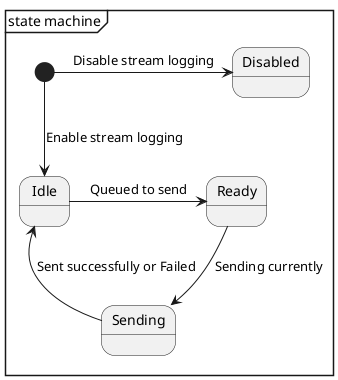

# All About Streams

[TOC]

-------------------------

## 1. Introduction
Radar processing consists of several modules. Each module produces some output. This output is sometimes needed for further analysis and hence logged out through available means like Ethernet. The output data thus logged out from each module is referred as **stream**.

For consistency, a uniform naming convention shall be followed for the files and the output structure / stream as shown below,

**\<module\>_stream.h** shall contain **\<module\>_Stream_T**
where module: mmic, rdd, vse, detection, debug etc.
For example, **rdd_stream.h** shall contain the definition of **RDD_Stream_T**.  This is output of RDD module, that will be logged out.

-------------------------

## 2. Types of Streams
Depending on the nature of streams, they are categorized as
**Regular**, **Regular_Fast**, **Static**, and **Dynamic**

More design details captured in the document [Stream_Handling_In_Modular_Arch](https://spo.aptiv.com/:f:/r/sites/0304-AdvEngSystems/AE_Software/Radar/NextGenRadar_WP_CI/SWE.2%20Software%20Architectural%20Design/GEN7?csf=1&web=1&e=YQzSXf).

### 2.1. Regular Streams:
The size of the stream is predefined by the **\<module\>_Stream_T**. However the content keeps changing every radar cycle, e.g. Detection, RDD, Tracker, etc. Most of the streams fall under this category. Every module output, is associated with a particular scan index. Thus the scan index is part of the stream header, and helps bring in uniformity and consistency.

* All the regular streams contain, stream header followed by the particular stream data. Refer [Stream Header](#stream-header).
* The ***streamRefIndex*** of Aptiv header shall be the scan index from the respective stream header.
* The image below shows, regular stream is split in to N chunks. c1, c2,...cN: chunk1, chunk2,... chunk N respectively.

  

### 2.2. Static Streams:
The size of the stream is predefined and also the data is constant across radar cycles. In other words, this data is  constant for a given power cycle, e.g. Unit Specific Calibrations (USC), System Modifiable Calibrations (SMC), etc. The calibrations shall **not** have the stream header.

**Note**: Design Considerations:
* In order to reproduce the scenarios appropriately from the Ethernet log, these calibrations are a must for radar systems engineers.

* As of now, only one stream number (14) is dedicated to handle all the calibrations. That is both USC and SMC are sent out using the same stream number.
* Since a single stream number is used for all the calibrations, stream version field of the APTIV / Rec header indicates the order of the calibrations in the system as per the **calibration.h**. That is, for ***streamNumber*** = **14** (calibrations), ***streamVersion*** =
    * 0: USC (Unit Specific Calibration)
    * 1: SMC (System Modifiable Calibration)
    * 2: PSC (Platform Specific Calibration) etc.
* And ***streamRefIndex*** shall be the 32 bit live counter for each calibration.
* The image below shows, static stream is split in to N chunks. c1, c2,...cN: chunk1, chunk2,... chunk N respectively.
   

* Usually the calibration data huge in size. Sending the same completely in a radar cycle may not be necessary and doing so affects Ethernet bandwidth. Thus a configurable number of chunks of calibrations can be sent per radar cycle, i.e. right now it's configured for one chunk of USC, one chunk of SMC per radar cycle. The same can be changed as needed.

### 2.3. Dynamic Streams:
The total size of the stream is NOT predefined. It's dynamic in nature as it depends on the scenario. Also the values keep changing too. These streams will have a variable payload and may have multiple instances with different values in each. As a result, the size of the stream may fluctuate every radar cycle e.g. CDC, TDC etc.
* A defined number of records (cdc) can be fit into an ethernet frame
* The dynamic header contains the records_count and scan_index
  * The records_count comes in handy while decoding the number of records in the current ethernet frame
  * scan_index helps in synchronization and integrity
* Each ethernet frame may contain several cdc records (corresponding to cdc bins)
* The image below shows, dynamic stream., where DSR: Dyanmic Stream Record
* c1, c2,...cN: dsr1, dsr2,... dsrN respectively.

  

### 2.4. Regular_Fast Streams:
The total size of the data is known, similar to Regular streams. However, the rate at which, it's generated is much faster than the Regular streams. Since the data to be sent out is huge, it's sent out as soon as possible. Thus, this type of streams are categorized as Regular_Fast.
Such streams are specific to streaming radars. E.g. Raw ADC stream, RFFT stream, DFFT stream, etc.

-------------------------

## 3. Stream Format
One needs to ensure that the data to be logged out doesn't contain any pad bytes / holes. This greatly helps in parsing the Ethernet log with ease. The basic output structure **\<module\>_Stream_T** shall be passed through a packing utility called STREAM_GENERATOR. This utility
* explicitly fills up the holes if any and
* increments the version number

As a rule of thumb, any modification **\<module\>_Stream_T** shall be passed through the STREAM_GENERATOR. This utility regenerates the **\<module\>_stream.h** file containing
* properly packed **\<module\>_Stream_T** structure and
* **version number** incremented by one

To know how to use it, refer the document below, **~\instrumentation\LogStruct_Gen\STREAM_GENERATOR_5_6_0\README.md**

**Note**: Calibrations like SMC/USC are generated by the radar systems, it's already properly packed. Hence, using the STREAM_GENERATOR utility for calibration streams is **prohibited**.

-------------------------

## 4. Streamdef File
This file contains the information about the stream structure, that is needed by the MATLAB based parsing utility. The build automatically generates the streadef files for all the available **<\module\>_stream.h** files in the project. The build uses the utility at the path below,
**~\instrumentation\LogStruct_Gen\DvrlStreamTool**

Typical streamdef file looks as below,
***streamdef_src'X'_str'Y'_ver'Z'.txt***
where
X: sourceInfo - e.g., 72: SRR7p
Y: streamNumber - e.g., 4: RDD
Z: streamVersion - e.g., 10: RDD_Stream_T version

Refer [Stream Identifiers](#721-stream-identifiers) for more information.

-------------------------

## 5. Streams Logging
Tools like **Wireshark** or **DV-Tool** can be used for logging the Ethernet data from the sensor.

**Wireshark** logs would be in *.pcapng format. The APTIV/Record Header of every Ethernet frame of the stream ,can be visualised in the tool itself, using **AptivUdpHeader.lua** script.

**DV-Tool** is an APTIV proprietary tool which can also be used to log the Ethernet data. Usually the logs would be in *.mudp or *.brr format.

For detailed analysis of the scenario, the captured log shall be parsed. Refer [Parsing the Logs](#6-parsing-the-logs) for more information.

-------------------------

## 6. Parsing the Logs
Parsing the log is important and very beneficial to analyze and observe the behavior of intermittent module outputs at different time instants when the SW is up and running.Parsing the log can be achieved through two ways,
1. MATLAB script - available in [sharepoint](https://spo.aptiv.com/:f:/r/sites/0304-AdvEngSystems/AE_Software/Radar/Big_Script%20and%20aptiv_data_to_mat?csf=1&web=1&e=2MLge8).
2. MUDP extractor tool

**Note**: The streamdef file corresponding to each of the streams is necessary for parsing. Refer [Streamdef File](#4-streamdef-file) for more information on streamdef file.

It supports both formats - namely, ***.mudp** and ***.brr**

**Note**: Logs captured using Wireshark in *.pcap/ng format, shall be converted to *.mudp / *.csv format using another utility called **PCAP_To_MUDP_Converter** available at the path mentioned  here [PCAP_To_MUDP_Converter_v3.zip](https://spo.aptiv.com/:u:/r/sites/0304-feec/ADP%20TDP/AS%20MRR-S/Shared%20Documents/ADV/DV_Tool)

As far as parsing the scripts, follow the script and provide the command in matlab accordingly. Refer the session [here](https://spo.aptiv.com/:u:/r/sites/0304-AdvActiveSafetySWSYS/Shared%20Documents/Trainings/common/Big%20Script%20KT%20and%20Next%20Steps-20240403_103235-Meeting%20Recording.mp4.url?csf=1&web=1&e=yxpUDJ)

-------------------------

## 7. Stream Handler Module
As of today all the streams are logged out through Ethernet over UDP protocol. However this is subject to customer requirement. The larger streams need to be broken down into multiple chunks and sent out.

### 7.1. Salient Features
Stream handler offers the following provisions,
1. Add / Remove streams with ease
2. Enable / Disable a stream transmission
3. Configure the number of chunks per radar cycle
4. Split a large stream into smaller chunks (chunking)

Dynamic / runtime configuration for any parameter is NOT supported. All the streams to be logged out shall be predefined. The initialization phase ensures to register each of the configured stream. The stream handler contains a queue, which is scanned periodically through the function **Periodic_Rec_Handler**. This function is further responsible for chunking the stream if necessary. Each module that needs to send out the stream marks an entry in to this queue by calling **Trigger_Stream_Handler** function.

**Note**: Only regular and static streams have been tested through stream handler

A typical APTIV UDP Frame looks like below,

| MAC Destination| MAC Source| Ether Type | IP Header | UDP Header | APTIV Header | Payload | CRC |
|---|---|---| --- | --- | --- | --- | --- |
|(6B)|(6B)|(2B)|(20B)| (8B) | (24B)| (1448B) | (4B)|

**Note**: Size of APTIV Header is subject to change, for A3 - 24B, A5 - 28B.

#### 7.1.1 APTIV Header:
Also referred as **Record header**, provides enough information about the stream. Refer **Rec_Hdr_T** in the file ***stream_header.h*** for more details. More info on [Aptiv Header](https://spo.aptiv.com/:x:/r/sites/0304-AdvEngSystems/AE_Software/Radar/NextGenRadar_WP_CI/SWE.2%20Software%20Architectural%20Design/GEN7/APTIV_Data_Header.xlsx?d=w4a9af0e9640646e29856b6e20e84fc98&csf=1&web=1&e=p0FYXN)

#### 7.1.2 Payload:
Contains the module specific data or the stream. The stream in turn may contain stream header.

##### 7.1.2.1 Stream Header:
Stream header shall be defined in **stream_header.h**. It provides more information about the stream, or the module that's producing the stream. Some of the fields available at the moment are as below,

* **size:** size of the stream excluding stream header
* **version:** version of the stream / module
* **checksum:** for data integrity check e.g. CRC, simple checksum
* **scan_index:** for synchronization purpose
* **error_info:** non-zero value represents an error
* **module_time_ms:** time consumed in milli seconds to produce a particular stream

**note:** More fields shall be added as per need.

For other fields, refer [Ethernet Frame Format.](https://en.wikipedia.org/wiki/Ethernet_frame)

### 7.2. Adding a new stream

Follow the steps below to add a new stream say e.g. TEST,

1. Create a file **test_stream.h** and add it to bazel build
2. Define the macros: **TEST_STREAM_NUMBER** and **TEST_STREAM_VERSION**.
Refer [Stream Identifiers](#721-stream-identifiers) for more information.
3. Create structure **Test_Stream_T** in it, refer [Stream Format](#3-stream-format)
4. Define a stream buffer **Test_Stream**
5. Add it to **STREAM_LIST** as below,
 e.g. **DCS_X(TEST, Test)** Where **TEST**: StreamID, **Test** prefix needed to realize **Test_Stream** and **Test_Stream_T**
1. Fill the **Test_Stream** buffer with data
2. Call **Trigger_Stream_Handler(TEST, &Test_Stream);** from the application

### 7.2.1 Stream Identifiers
1. **sourceInfo**:
This field refers to the type of sensor sending out the streams, e.g., for radars: SRR7p, SRR6, etc.

2. **streamNumber**:
It is a unique number assigned by the architecture team, helps in identifying the stream, across variants and/or generations. All streams numbers are captured in the confluence page here - [StreamNumbers](https://confluence.asux.aptiv.com/display/AASSA/GPO+Radar+Stream+Numbers)

   |streamNumber|Module| |streamNumber|Module|
   |---|---|---|---|---|
   |1| DETECTION | |11| RFFT |
   |2| HEADER | |12| BLOCKAGE |
   |3| STATUS | |13| ADC |
   |4| RDD | |14| CALIB |
   |5| VSE | | 20| RADAR_CAPABILITY |
   |6| CDC | | 21| DOWN_SELECTION |
   |7| DEBUG | |36 | ID (Interference Detection)|
   |8| MMIC | | 40 | TOI (Target Of Interest)|
   |9| ALIGNMENT | |45 | DRA (Dynamic Radar Alignement) |

   For example: define **TEST_STREAM_NUMBER** in **test_stream.h** as below,
   \#define TEST_STREAM_NUMBER (1U)

1. **streamVersion**:
It helps keep track of the changes in the stream's structure and thus supports backward compatibility. Having the right version helps in parsing the stream correctly - using the corresponding streamdef file.
For example: define **TEST_STREAM_VERSION** in **test_stream.h** as below,
\#define TEST_STREAM_VERSION (7U)

### 7.3. State Machine:

There is a state associated with each stream. The state transitions are captured in the image below,

**State Transitions**
1. On initialization the stream gets registered and state shall be marked as **IDLE** - indicating the stream is initialized.
2. Stream state transitions to **DISABLED** if it's NOT enabled for transmission.
3. It transitions to **READY** from **IDLE** if there is a trigger from the application. This marks an entry into the queue as well.
4. **Periodic_Rec_Handler** checks this queue and sends those streams that are marked as **READY**. The state transitions to **SENDING** from **READY**. The configured number of chunks are sent out for the stream. For, regular streams - send all chunks per radar cycle, while for static streams - send one chunk per radar cycle. For static streams, the stream handler module takes care of sending subsequent configured chunks in successive radar cycles.
5. The state transitions to **IDLE** from **SENDING**. Any failure would be captured as an error and latched. The application needs to trigger the stream periodically.

And the steps repeat.

**Note:** It's wiser to configure the task  **Periodic_Stream_Handler()** at a faster rate say e.g. 5ms. This in turn calls **Periodic_Rec_Handler()**

### 7.4 APIs

1. **Stream_Handler_Init():** Ensures to initialize the stream handler and the queue.
2. **Periodic_Stream_Handler():** Sends out the streams marked on the queue using **Periodic_Rec_Handler()**
3. **Trigger_Stream_Handler():** The application module shall call this function with two input arguments. It marks an entry into the stream handler's queue.e.g. **Trigger_Stream_Handler(TEST, &Test_Stream);**
This API shall push the stream into queue for regular and static streams. Owing to the huge size of data in dynamic and regular_fast streams, they are not pushed into queue but rather are transmitted out immediately by this API.
**Note:** The rate of generation of data is usually greater than sending it out. So, having an intermediate buffer will help overcome it.
4. **void Calculate_Checksum():** API to calculate checksum for each stream. It's derived from 'app_chksum' module.
5. **Enable_Stream_Recording():** Based on various pre-conditions, it can enable or disable all the Streams.
6. **Update_Stream_Handler_Input():** The static inputs as needed are updated at the init stage.
7. **Stream_Config_Init():** To configure stream specific  parameters.
8. **Calib_Stream_Config_Init():** To configure calibration stream specific config parameters.
9. **Get_Stream_Error():** Each module can query its stream specific errors.

The following APIs are exposed based on the need.
1. **Rec_Handler_Cancel_Send():** Any stream queued up to be sent i.e. in ‘READY’ state
2. **Rec_Handler_Get_Stream_State():** Get to know the state of the current stream, namely Idle, Ready, Sending, Disabled.
3. **Rec_Handler_Modify_Stream():** Modify the Record Header, payload pointer and length during runtime.
4. **Rec_Handler_Send_Stream():** Queue up the stream to send out.
5. **Rec_Handler_Add_Stream():** Registers the stream for later processing.
6. **Push_Stream_On_Queue():** Pushes the stream on to the queue.
7. **Pop_Stream_From_Queue():** Pops out the stream from the queue.
8. **Rec_Handler_Init():** Initializes the queue.
9. **Stream_Config_Init():** Initializes the stream configurations. When a new stream is added (Refer [Adding a Stream](#72-adding-a-new-stream)), the stream gets characterized by default values of the parameters, as of now in this function one could alter the default values if necessary.

### 7.5 Error Codes

|Error Id|Value|Description|
| --- | :---: | --- |
|REC_HANDLER_OK                  | 0  | Request successfully executed |
|REC_HANDLER_NOT_OK              | 61 | Request unsuccessful |
|REC_HANDLER_INVALID_ID          | 62 | Invalid Stream ID used |
|REC_HANDLER_INCORRECT_STATE     | 63 | Stream's state is incorrect |
|REC_HANDLER_INVALID_STREAM_ADDR | 64 | Stream buffer's address is invalid |
|REC_HANDLER_OVERWRITE           | 65 | New stream data has overwritten previous one |
|REC_HANDLER_BUSY                | 66 | The stream is being sent currently |
|REC_HANDLER_Q_FULL              | 67 | The queue holding streams to send out is full |
|REC_HANDLER_STREAM_UNINIT       | 68 | Stream is not initialised |
|REC_HANDLER_TX_FAILED           | 69 | Failed to transmit the stream |

-------------------------

## 8. File Revision History

|Rev|Date|NetId|Name|SCR|
|---|---|---|---|---|
|0.1|18-Jul-2022| qjrdfk| Venkatesh| DDR-1666|
|0.2|22-Jul-2022| bz571t| Umesh| DDR-1666|
|0.3|28-Jul-2022| bz571t| Umesh| DDR-1731|
|0.4|06-Jan-2023| qjrdfk| Venkatesh| DDR-1887|
|0.5|25-Oct-2023| w8hbpk| Manas| DDR-2714|
|0.6|20-Feb-2024| bz571t| Umesh| DNP-4585|
|0.7|13-May-2024| bz571t| Umesh| EUR-561|
|0.8|05-Jun-2024| bz571t| Umesh| EUR-593|
