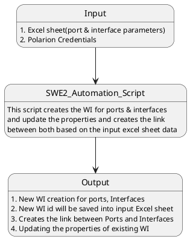

# SWE.2 Automation

[TOC]

-------------------------

## 1. Introduction:
SWE.2 Automation is made it for SAD Dcoument preparaion(5.2.1 SAD_Radar). The purpose of the script to avoid the manual work in polarion to creates the WI for ports and interfaces and creates the link between ports & interfaces. It saves our most valuable time to create/update the WI for ports and interfaces manually.

The image below shows the overview about the script.

## 2. Usage:
- New WI creation for ports, Interfaces and updating the properties of port & interface
- New WI id will be saved into input Excel sheet
- creates the link between Ports and Interfaces
- Updating the properties to existing WI

## 3. Sharepoint path:
SWE.2 Automation Script is available in [Sharepoint](https://spo.aptiv.com/:f:/r/sites/0304-AdvEngSystems/AE_Software/Radar/NextGenRadar_WP_CI/SWE.2%20Software%20Architectural%20Design/Automation/SWE.2%20Automation?csf=1&web=1&e=GdTb5x)

## 4. Installation
Please ensure python is installed on your machine, on top of that please install Pandas, openpyxl, tqdm, zeep
- py -m pip install pandas
- py -m pip install openpyxl
- py -m pip install tqdm
- py -m pip install zeep

## 5. Steps to follow to run the Script

1. Update the Polarion credentials in credentials python file, its available in [credentials](https://spo.aptiv.com/sites/0304-AdvEngSystems/AE_Software/Forms/AllItems.aspx?id=%2Fsites%2F0304%2DAdvEngSystems%2FAE%5FSoftware%2FRadar%2FNextGenRadar%5FWP%5FCI%2FSWE%2E2%20Software%20Architectural%20Design%2FAutomation%2FSWE%2E2%20Automation%2Fcredentials&viewid=36d4fceb%2D116d%2D46e1%2D8583%2D8d370459cbdc)

1. Excel Sheet Update:
    - Excel sheet template file is available in [input folder](https://spo.aptiv.com/sites/0304-AdvEngSystems/AE_Software/Forms/AllItems.aspx?id=%2Fsites%2F0304%2DAdvEngSystems%2FAE%5FSoftware%2FRadar%2FNextGenRadar%5FWP%5FCI%2FSWE%2E2%20Software%20Architectural%20Design%2FAutomation%2FSWE%2E2%20Automation%2Finput&viewid=36d4fceb%2D116d%2D46e1%2D8583%2D8d370459cbdc)
    - Please provide all required parameters in the excel sheet
    - Parent ID is mandatory to provide, if its new WI to be created
    - Save and close the Excel sheet (Mandatory)

1. Finally, Run the batch file(Create_SAD_req.bat), its available in [SWE.2 Automation Folder](https://spo.aptiv.com/sites/0304-AdvEngSystems/AE_Software/Forms/AllItems.aspx?id=%2Fsites%2F0304%2DAdvEngSystems%2FAE%5FSoftware%2FRadar%2FNextGenRadar%5FWP%5FCI%2FSWE%2E2%20Software%20Architectural%20Design%2FAutomation%2FSWE%2E2%20Automation&viewid=36d4fceb%2D116d%2D46e1%2D8583%2D8d370459cbdc)

-------------------------

## 6. File Revision History

|Rev|Date|NetId|Name|SCR|
|---|---|---|---|---|
|0.1|17-Jul-2024| d4r9fs | Sankar M | EUR-743|
