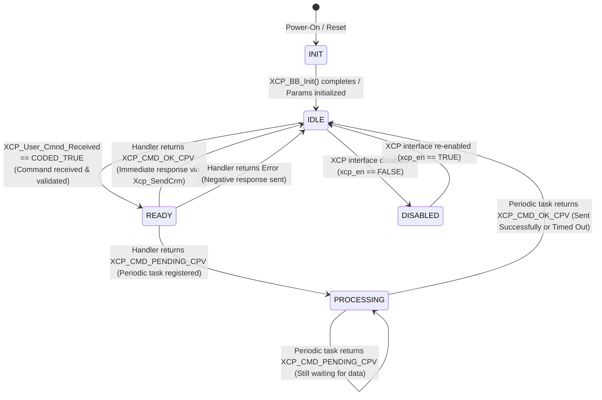
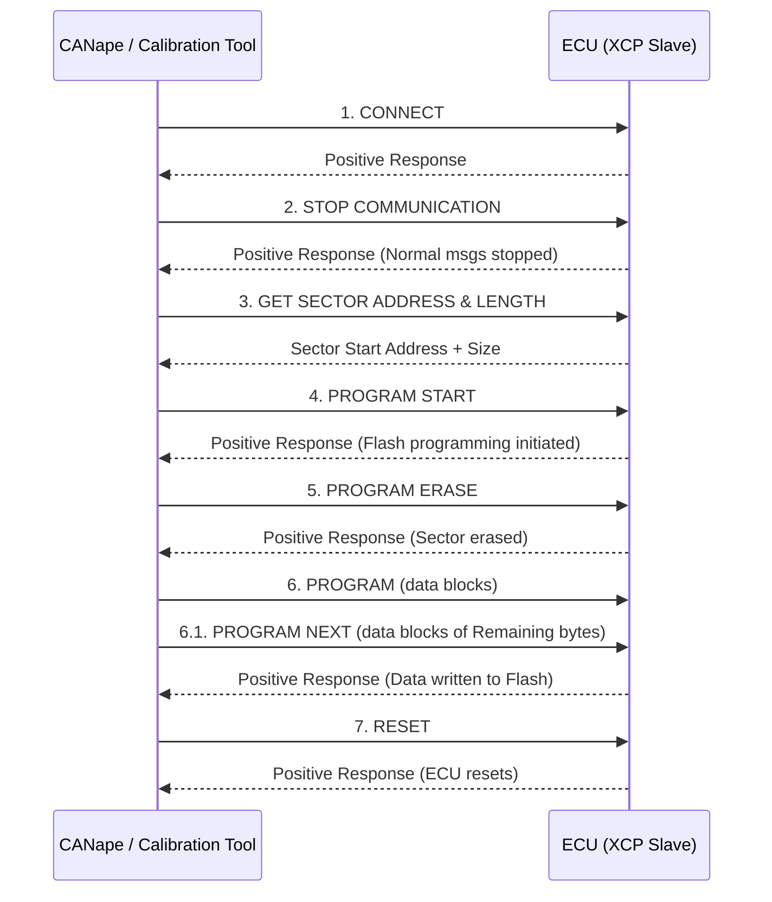

# XCP User Command State Machine

---

## 1. Introduction

This document explains about the standard calibration protocol used across the automotive domain.
XCP is a improvised and genralised version of CCP (Can Calibration Protocol).
XCP stands for "The Universal Measurement and Calibration Protocol Family"

The "X" generalizes the "various" transportation layers that are used by the members of the protocol family e.g "XCP on CAN", "XCP on TCP/IP", "XCP on UDP/IP", "XCP on USB" and so on.


### 1.1 XCP Calibration Architecture

The overall calibration data flow spans from the calibration tool down to the ECU's RAM/Flash variables:

```
Calibration Tool (CANape / INCA)
            │
            │  XCP Commands
            ▼
Transport Layer (CAN / Ethernet / FlexRay)
            │
            ▼
XCP Driver (protocol stack)
            │
            │  APIs / callbacks
            ▼
XCP Application (project-specific configuration)
            │
            ▼
ECU Application (Radar algorithms, tracking, fusion)
            │
            ▼
RAM / Flash variables
```

| Layer | Role |
|---|---|
| **XCP Driver** | *How* communication happens — handles protocol, transport, and packet parsing |
| **XCP Application** | *What* data is communicated — exposes radar-specific parameters and measurements |
| **ECU Application** | *Where* data is generated — radar algorithms, tracking, fusion |

---

## 2. XCP Protocol Layer

### 2.1. The XCP Packet types

All XCP communication is exchanged as data objects called XCP Packets.
Basically there are 2 types of Packets:

- Packet for transferring generic control commands : ***CTO***

  It is used for carrying out protocol commands (CMD), transferring command responses (RES), error (ERR) packets, event (EV) packets and for service request packets (SERV).

- Packet for transferring synchronous data : ***DTO***

  It is used for transmitting synchronous data acquisition data (DAQ) and for transmitting synchronous data stimulation data (STIM).


A Command Packet will always be answered by a Command Response Packet or an Error Packet.

Event, Service Request and Data Acquisition Packets are sent asynchronously, therefore it may not be guaranteed that the master device will receive them when using a non acknowledged transportation link like e.g. UDP/IP.

The XCP Handler may not always have access to the resources of the XCP slave. With ERR_RESOURCE_TEMPORARY_NOT_ACCESSIBLE the XCP Handler can indicate this situation to the master.

### 2.2. XCP Packet Format


The XCP Packet contains the generic part of the protocol, which is independent from the transport layer used.
An XCP Packet consists of an Identification Field, an optional Timestamp Field and a Data Field.

#### 2.2.1. Identification Field

When exchanging XCP Packets, both master and slave should always be able to unambiguously identify any transferred XCP Packet with its Type and the contents of its Data Field.
For this purpose, XCP Packet always starts with an Identification Field which as first byte contains the Packet IDentifier (PID).

- For CTO Packets, Identification field should be able to identify their Type, distinguishing between protocol Commands (CMD), Command Responses (RES), Error Packets (ERR), Event Packets (EV) and Service Request Packets (SERV).
- For DTO Packets, Identification field should be able to identify their Type, distinguishing between DTO Packets for DAQ and STIM.

In CTO Packets, Identification Field contains only PID which contains CTO Packet Code.

In DTO Packets, Identification Field should be able to identify unambiguously the DAQ list and the ODT within the DAQ list, that describes the contents of the data field.
So, for DTO Packets with Identification Field Type "absolute ODT number", the Identification Field just consists of the PID, containing the absolute ODT number.
For DTO Packets with Identification Field Types "relative ODT number and absolute DAQ list number", the Identification Field consists of the PID, containing the relative ODT number, DAQ bits, containing the absolute DAQ list number, and an optional FILL byte.

#### 2.2.2. Timestamp

An XCP Packet optionally might contain a Timestamp field. For CTO Packets, the Timestamp field is not available.
For DTO Packets, after the Identification field there might be a Timestamp field. The TIMESTAMP_SUPPORTED flag at GET_DAQ_PROCESSOR_INFO indicates whether the slave supports time stamped data acquisition and stimulation.

#### 2.2.3. Data Field

XCP Packets finally contain a Data field.
For CTO Packets, the Data field contains the specific parameters for different types of CTO packets.
For DTO packets, the Data field contains the data for synchronous acquisition and stimulation.

### 2.3 DAQ (Data Acquisition)

DAQ (Data AcQuisition) allows a calibration tool to configure a set of variables to be periodically sampled and transmitted together as a single DTO packet, minimising bus load compared to individual uploads.

```
Calibration Tool       ECU RAM
      ↓                   │
Configure DAQ list        │
      ↓               Variables:
XCP Driver            1. ObjectDistance
      ↓               2. ObjectVelocity
Periodic task ──────► 3. ObjectAngle
      ↓               4. SignalStrength
Read all variables        │
      ↓               ◄───┘
Transmit DAQ packet
      ↓
CANape receives data
```

The calibration tool configures which variables belong to each DAQ list. On each period the XCP driver reads all listed variables from ECU RAM in one pass and bundles them into a single DAQ packet.

### 2.4 Transport Layer Variants

The project supports both CAN-based and Ethernet-based XCP transport layers.

| Transport | Raw Speed | Application Payload per Frame |
|---|---|---|
| **XCP on CAN (Classic CAN)** | 500 kbps – 1 Mbps | 8 bytes |
| **XCP on CAN FD** | 2 – 8 Mbps (data phase) | Up to 64 bytes |
| **XCP on Ethernet** | 100 Mbps / 1 Gbps | Up to ~1500 bytes (Ethernet MTU) |

---

## 3. Overview

This document describes the state machine governing XCP User Command processing in the Gen8 iND13400 radar software. XCP command dispatching and periodic execution lifecycle.

### 3.1 Components Involved

| Component | File | Role |
|---|---|---|
| **SWC_PLT_CDD_XCP** | `SWC_PLT_CDD_XCP.c` | AUTOSAR SWC wrapper; orchestrates the state machine via `RE_XCP_10ms` and `RE_XCP_50ms` runnables |
| **xcp_bb.c** | `SWC_PLT_Appl_XCP/Source/xcp_bb.c` | Building Block; initializes input parameters, dispatches periodic tasks |
| **xcp_user_cmds.c** | `SWC_PLT_Appl_XCP/Source/xcp_user_cmds.c` | Command handler; validates, dispatches, and executes user commands |

### 3.2 XCP Driver vs XCP Application

| Aspect | XCP Driver  | XCP Application  |
|---|---|---|
| **Purpose** | Implements the XCP protocol stack | Uses XCP services for project-specific functions |
| **Responsibility** | Handles protocol communication | Defines what data/signals are exposed |
| **Layer** | Lower / software stack layer | Higher application layer |
| **Typical code** | Packet parsing, DAQ, upload/download, transport handling | Calibration variables, measurements, custom commands |
| **Awareness of radar functions** | Usually generic | Knows radar-specific parameters |
| **Reusability** | Reused across projects | Changes project to project |

### 3.3 End-to-End Example: Variable Read via CANape

The following shows how CANape reads a radar variable (e.g. `float RadarObjectVelocity`):

```
Step 1: Calibration tool sends request
        "Read memory address 0x20001000"
        Tool → CAN/Ethernet: CONNECT, SET_MTA, UPLOAD

Step 2: Transport layer delivers the XCP frame to the XCP driver.

Step 3: XCP driver interprets the command:
        - Which command? Read request / Write request / DAQ request?
        - Is the address valid?

Step 4: XCP application maps variables — resolves symbolic name to ECU RAM address.

Step 5: ECU application provides actual data:
        Radar algorithm
             ↓
        RAM variable updated  (RadarObjectVelocity = 45.3f)
             ↓
        XCP application mapping
             ↓
        XCP driver reads RAM
             ↓
        CAN/Ethernet packet sent
             ↓
        CANape shows: Velocity = 45.3 km/h
```

---

## 4. State Machine Diagram

```
                          ┌──────────┐
                          │   Init   │
                          └────┬─────┘
                               │ XCP_BB_Init_Const_Ptr() completes
                               ▼
              ┌────────── ┌──────────┐ ──────────┐
              │           │   Idle   │           │
              │           └──┬───┬───┘           │
              │              │   │               │
  XCP interface          Cmd │   │ XCP interface │
  re-enabled             Rx  │   │ disabled      │
  (xcp_en=TRUE)              │   │  (xcp_en=FALSE)
              │              │   │               │
              │              ▼   │               ▼
         ┌────┴─────┐  ┌────────┴──┐     ┌──────────┐
         │ Disabled  │  │  Ready    │     │ Disabled  │
         └──────────┘  └──┬─────┬──┘     └──────────┘
                          │     │
          CMD_PENDING_CPV │     │ CMD_OK_CPV or Error
                          │     │ (Immediate response)
                          ▼     │
                    ┌───────────┐│
                    │Processing ││
                    │           ││
                    │  ┌──┐     ││
                    │  │  │ Still││
                    │  │  │ Pending
                    │  └──┘     ││
                    └─────┬─────┘│
                          │      │
          Done/Timeout    │      │
          (CMD_OK_CPV)    │      │
                          ▼      ▼
                       ┌──────────┐
                       │   Idle   │
                       └──────────┘
```

### Mermaid Representation



---

## 5. State Descriptions

### 5.1 INIT

| Property | Value |
|---|---|
| **Entry Condition** | Power-on / ECU reset |
| **Activity** | `XCP_BB_Init_Const_Ptr()` populates constant-time pointers (operation mode, output state, alignment data, etc.) |
| **Exit Condition** | Initialization complete → transition to **IDLE** |
| **Component** | `xcp_bb.c` |

### 5.2 IDLE

| Property | Value |
|---|---|
| **Entry Condition** | Init complete, or command processing finished, or re-enabled from Disabled |
| **Activity** | `RE_XCP_10ms` calls `XCP_BB_Input_Params_Init()` every cycle to refresh sensor/state data (ADC, temperatures, targets, checksums, fault tables) |
| **Exit Condition** | `XCP_User_Cmnd_Received == CODED_TRUE` → **READY**, or XCP disabled → **DISABLED** |
| **Key Guard** | `Get_XCP_Pending_Cmnd_Status() == CODED_FALSE` (no pending command) |
| **Component** | `SWC_PLT_CDD_XCP.c` (`RE_XCP_10ms`), `xcp_bb.c` |

### 5.3 READY

| Property | Value |
|---|---|
| **Entry Condition** | XCP core signals a user command was received |
| **Activity** | Command validation and dispatch: `get_xcp_user_cmd_index()` → `XCP_User_Cmd_Func_List[index]()` |
| **Exit to IDLE** | Handler returns `XCP_CMD_OK_CPV` (immediate response) or error → `Xcp_SendCrm()` / `prepare_negative_response()` |
| **Exit to PROCESSING** | Handler returns `XCP_CMD_PENDING_CPV` and calls `set_xcp_periodic_user_cmd(cmd, max_cnt, fptr)` |
| **Component** | `xcp_user_cmds.c` (`XCP_User_Command()`) |

### 5.4 PROCESSING (Sending)

| Property | Value |
|---|---|
| **Entry Condition** | A multi-cycle command was accepted; periodic callback registered |
| **Activity** | `RE_XCP_50ms` calls `XCP_Periodic_Task()` → dispatches to registered `XCP_Periodic_User_Cmd_Task_Fptr` |
| **Self-Loop** | Periodic task returns `XCP_CMD_PENDING_CPV` — cycle counter incremented, continue polling |
| **Exit to IDLE (Success)** | Data becomes available before timeout → positive response built → `Xcp_SendCrm()` → `Clear_XCP_Periodic_User_Cmd` |
| **Exit to IDLE (Timeout)** | `Is_Cycle_Cnt_Timedout` → negative response (`XCP_ERR_CMD_SYNTAX_CPV`) → `Clear_XCP_Periodic_User_Cmd` |
| **Component** | `SWC_PLT_CDD_XCP.c` (`RE_XCP_50ms`), `xcp_bb.c` (`XCP_Periodic_Task`), `xcp_user_cmds.c` (periodic callbacks) |

### 5.5 DISABLED

| Property | Value |
|---|---|
| **Entry Condition** | XCP interface disabled via `Rte_Read_s_aptiv_xcp_en_EN_DIS()` returning `FALSE` |
| **Activity** | No command processing; inputs may still be refreshed |
| **Exit Condition** | XCP interface re-enabled (`xcp_en == TRUE`) → **IDLE** |
| **Component** | `SWC_PLT_CDD_XCP.c` |

---

## 6. Command Processing Flow (Sequence)

```
    XCP Core          SWC_PLT_CDD_XCP        xcp_bb.c          xcp_user_cmds.c
       │                    │                    │                    │
       │   [STATE: INIT]    │                    │                    │
       │                    ├──Init Const Ptr──>│                    │
       │                    │                    │                    │
       │   [STATE: IDLE]    │                    │                    │
       │                    ├──Params Init─────>│                    │
       │                    │  (every 10ms)      │                    │
       │                    │                    │                    │
       │  Cmd Received      │                    │                    │
       ├──────────────────>│                    │                    │
       │                    │ [STATE: READY]     │                    │
       │                    ├──UserCommand()───────────────────────>│
       │                    │                    │  dispatch handler  │
       │                    │                    │                    │
       │              ┌─────┴─────────────────────────────────────────┤
       │              │ Case A: Immediate (CMD_OK)                   │
       │              │    ←────────────────────────── CMD_OK_CPV ───┤
       │              │    Xcp_SendCrm()                             │
       │              │    [STATE: IDLE]                              │
       │              ├──────────────────────────────────────────────┤
       │              │ Case B: Pending (CMD_PENDING)                │
       │              │    ←──────────────────── CMD_PENDING_CPV ───┤
       │              │    [STATE: PROCESSING]                       │
       │              │                                              │
       │              │    (every 50ms)                              │
       │              │    ├──Periodic Task──>│──callback()────────>│
       │              │    │                  │     (poll data)      │
       │              │    │                  │  ←─ CMD_PENDING ────┤
       │              │    │    ... repeat ...│                      │
       │              │    │                  │  ←─ CMD_OK_CPV ────┤
       │              │    │  Xcp_SendCrm()   │                     │
       │              │    │  [STATE: IDLE]   │                     │
       │              └──────────────────────────────────────────────┘
```

---

## 8. Return Codes & Error Handling

### 8.1 Command Return Status

| Code | Constant | Meaning |
|---|---|---|
| `0x00` | `XCP_CMD_OK_CPV` | Command completed; response is ready |
| `0x01` | `XCP_CMD_PENDING_CPV` | Command accepted; periodic task will produce the response |
| `0x21` | `XCP_CMD_SYNTAX_CPV` | Invalid command or parameter |

### 8.2 XCP Error Codes (in negative response)

| Code | Constant | Typical Cause |
|---|---|---|
| `0x00` | `XCP_ERR_CMD_SYNCH_CPV` | No error (success placeholder) |
| `0x10` | `XCP_ERR_CMD_BUSY_CPV` | NVM operation in progress |
| `0x20` | `XCP_ERR_CMD_UNKNOWN_CPV` | Unrecognized command byte |
| `0x21` | `XCP_ERR_CMD_SYNTAX_CPV` | Invalid sub-command / timeout |
| `0x22` | `XCP_ERR_OUT_OF_RANGE_CPV` | Parameter out of valid range |
| `0x23` | `XCP_ERR_WRITE_PROTECTED_CPV` | Write to protected memory |
| `0x25` | `XCP_ERR_ACCESS_LOCKED_CPV` | Access requires seed/key unlock |
| `0x33` | `XCP_ERR_MFG_MODE_NOT_ENTERED` | Manufacturing mode not active |
| `0x81` | `XCP_ERR_CONDITIONS_NOT_CORRECT` | Preconditions not met |

---

## 9. Commands by Execution Pattern

### 9.1 Immediate Commands (READY → IDLE)

These commands complete within a single `RE_XCP_10ms` cycle. The handler fills the response buffer and returns `XCP_CMD_OK_CPV`.

| Cmd Byte | Name | Description |
|---|---|---|
| `0x01` | `SET_OPERATION_MODE` | Set radar operating mode (Normal/EOL/Service) |
| `0x02` | `RADAR_TRANSMITTER_ENABLE` | Force radar radiate on/off |
| `0x03` | `STOP_TRANSMITTING_PERIODIC_MSGS` | Stop/start periodic CAN messages |
| `0x04` | `CLEAR_INTERNAL_FAULT_CODES` | Clear fault code tables |
| `0x06` | `GET_START_ADDRESS_SIZE_EVENT_INFO` | DAQ descriptor table info |
| `0x0B` | `SINGLE_LOOK_MODE` | Enable/disable individual look mode |
| `0x0C` | `GET_SW_VERSION` | Read software version info |
| `0x0D` | `READ_HARDWARE_VERSION` | Read board revision |
| `0x0E` | `DSP_SIMULATION` | DSP ITV simulation control |
| `0x0F` | `ITV_SIMULATION_CONTROL` | ADC override / ITV event control |
| `0x11` | `OVERRIDE_MEMORY_FAULT` | Override fault memory action |
| `0x12` | `FAKE_INJECT_FAULT` | Inject test faults (per domain) |
| `0x14` | `SET_RADAR_TO_CW_MODE` | Enable/disable CW mode |
| `0x1F` | `SET_OUTPUT_STATE` | Control LED/output state |
| `0x23` | `GET_OVERRIDE_CONTROL_VARIABLE` | Read override variable state |
| `0x97` | `GET_MCU_ID` | Read MCU unique ID |
| `0x98` | `GET_TRANSCIEVER_CHIP_ID` | Read MMIC chip ID |
| `0x9A` | `TARGET_SELECT` | Select target for tracking |
| `0x9F` | `GET_MMIC_MCU_TEMP` | Read MMIC & MCU temperatures |
| `0xB0` | `GET_FAULT_TEST_COMPLETED` | Read fault test completed table |
| `0xC0` | `GET_HISTORY_FAULT` | Read history fault table |
| `0xD0` | `GET_ACTIVE_FAULT` | Read active fault table |
| `0xE0` | `GET_ACTIVE_FAULT_LATCHED` | Read latched active fault table |

### 9.2 Multi-Cycle Commands (READY → PROCESSING → IDLE)

These commands require multiple `RE_XCP_50ms` cycles. The handler registers a periodic callback via `set_xcp_periodic_user_cmd()`.

| Cmd Byte | Name | Periodic Callback | Timeout (cycles × 50ms) |
|---|---|---|---|
| `0xA0` | `GET_HOST_ANALOG_INPUTS_0TO30` | `XCP_ADC_Info_Periodic_Task` | 3 × 50ms = 150ms |
| `0xA1` | `GET_HOST_ANALOG_INPUTS_31TO61` | `XCP_ADC_Info_Periodic_Task` | 3 × 50ms = 150ms |
| `0xA2` | `GET_FILTERED_ADC_INPUTS_0TO30` | `XCP_Filtered_ADC_Info_Periodic_Task` | 3 × 50ms = 150ms |
| `0xA3` | `GET_FILTERED_ADC_INPUTS_31TO61` | `XCP_Filtered_ADC_Info_Periodic_Task` | 3 × 50ms = 150ms |
| `0x90` | `GET_RADAR_TARGET` | `XCP_Target_Info_Periodic_Task` | 5 × 50ms = 250ms |
| `0x22` | `SET_OVERRIDE_CONTROL_VARIABLE` | `XCP_Set_Override_Periodic_Task` | 61 × 50ms = 3.05s |
| `0x30` | `WRITE_ALIGNMENT_DATA` | `XCP_Write_Alignment_Periodic_Task` | 101 × 50ms = 5.05s |
| `0x85` | `GET_CHECKSUM_RESULTS` | `XCP_Chksum_Updation_Periodic_Task` | Configurable |
| `0x13` | `READ_WRITE_DID` | `XCP_DID_Periodic_Task` | Configurable |

---

## 10. Periodic Task Mechanism

### 10.1 Registration

When a command handler determines it needs multiple cycles:

```c
set_xcp_periodic_user_cmd(cmd_value, max_cycle_cnt, periodic_fptr);
/* Sets:
 *   xcp_periodic_user_cmd_val      = cmd_value
 *   xcp_periodic_cycle_cnt_max     = max_cycle_cnt
 *   xcp_periodic_cycle_cnt         = 0
 *   xcp_periodic_user_cmd_rcvd     = CODED_TRUE
 *   xcp_periodic_user_cmd_task_ptr = periodic_fptr
 */
```

### 10.2 Execution (RE_XCP_50ms)

```c
/* In SWC_PLT_CDD_XCP.c :: RE_XCP_50ms() */
if (CODED_TRUE == Get_XCP_Pending_Cmnd_Status())
{
    retValue = XCP_Periodic_Task(response, framelength);
    if (XCP_CMD_OK == retValue)
    {
        Xcp_SendCrm(XCP_CHANNEL_IDX);  /* Send completed response */
    }
    /* else: XCP_CMD_PENDING — continue next cycle */
}
```

### 10.3 Timeout Detection

```c
#define XCP_Periodic_Cycle_Cnt   (XCP_Periodic_User_Cmd_Ptr->xcp_periodic_cycle_cnt)
#define XCP_Periodic_Cycle_Max   (XCP_Periodic_User_Cmd_Ptr->xcp_periodic_cycle_cnt_max)
#define Is_Cycle_Cnt_Valid       (XCP_Periodic_Cycle_Cnt < XCP_Periodic_Cycle_Max)
#define Is_Cycle_Cnt_Timedout    (XCP_Periodic_Cycle_Cnt == XCP_Periodic_Cycle_Max)
#define Clear_XCP_Periodic_User_Cmd  set_xcp_periodic_user_cmd(0U, 0U, NULL)
```

---

## 11. Component Responsibility Matrix

| State | SWC_PLT_CDD_XCP | xcp_bb.c | xcp_user_cmds.c |
|---|---|---|---|
| **INIT** | Calls init | `XCP_BB_Init_Const_Ptr()` | — |
| **IDLE** | Runs `RE_XCP_10ms`, checks `XCP_User_Cmnd_Received` | `XCP_BB_Input_Params_Init()` | — |
| **READY** | Calls `SWC_Xcp_UserCommand()`, sends immediate response | — | `XCP_User_Command()` → handler dispatch |
| **PROCESSING** | Runs `RE_XCP_50ms`, checks pending status, sends response | `XCP_Periodic_Task()` dispatches callback | Periodic callbacks (ADC, Target, Override, etc.) |
| **DISABLED** | Monitors `xcp_en` flag | — | — |

---

## 12. File Locations

| File | Path |
|---|---|
| AUTOSAR SWC | `software/r52/autosar/swc/SWC_PLT_CDD_XCP/Source/SWC_PLT_CDD_XCP.c` |
| Building Block Source | `software/r52/autosar/swc/Building_Blocks/SWC_PLT_Appl_XCP/Source/xcp_bb.c` |
| User Commands Source | `software/r52/autosar/swc/Building_Blocks/SWC_PLT_Appl_XCP/Source/xcp_user_cmds.c` |
| User Commands Header | `software/r52/autosar/swc/Building_Blocks/SWC_PLT_Appl_XCP/Include/xcp_user_cmds.h` |
| BB Types Header | `software/r52/autosar/swc/Building_Blocks/SWC_PLT_Appl_XCP/Include/xcp_bb_types.h` |
| BB Interface Header | `software/r52/autosar/swc/Building_Blocks/SWC_PLT_Appl_XCP/Include/xcp_bb.h` |

---

## 13. Mfg Related Issues

### 13.1 DAQ

In general, the DAQ (Data Acquisition) payload should not exceed the maximum payload supported by the underlying physical communication bus.
For example:

**CAN FD**
Maximum data payload per frame: 64 bytes
DAQ payload can be up to 64 bytes per frame.

**Ethernet**
Standard Ethernet MTU: 1500 bytes of payload
DAQ packet payload should fit within the Ethernet frame payload limits after accounting for protocol overhead (XCP, UDP/TCP, IP, Ethernet headers).

#### DAQ List Configuration

The following illustrates a single DAQ list containing 3 ODTs, each with 5 ODT entries:

```
┌─────────────────────────────────────────────────────────────────────────────┐
│                              DAQ List 0                                     │
│                                                                             │
│  ┌─────────────────────────────────────────────────────────────────────┐    │
│  │  ODT 0                                                              │    │
│  │                                                                     │    │
│  │   ┌──────────┬────────────────┬────────┐                            │    │
│  │   │ ODT Entry│   Address      │ Length │                            │    │
│  │   ├──────────┼────────────────┼────────┤                            │    │
│  │   │    1     │  0x20001000    │   4    │                            │    │
│  │   │    2     │  0x20001004    │   4    │                            │    │
│  │   │    3     │  0x20001008    │   2    │                            │    │
│  │   │    4     │  0x2000100A    │   2    │                            │    │
│  │   │    5     │  0x2000100C    │   4    │                            │    │
│  │   └──────────┴────────────────┴────────┘                            │    │
│  └─────────────────────────────────────────────────────────────────────┘    │
│                                                                             │
│  ┌─────────────────────────────────────────────────────────────────────┐    │
│  │  ODT 1                                                              │    │
│  │                                                                     │    │
│  │   ┌──────────┬────────────────┬────────┐                            │    │
│  │   │ ODT Entry│   Address      │ Length │                            │    │
│  │   ├──────────┼────────────────┼────────┤                            │    │
│  │   │    1     │  0x20002000    │   4    │                            │    │
│  │   │    2     │  0x20002004    │   4    │                            │    │
│  │   │    3     │  0x20002008    │   2    │                            │    │
│  │   │    4     │  0x2000200A    │   2    │                            │    │
│  │   │    5     │  0x2000200C    │   4    │                            │    │
│  │   └──────────┴────────────────┴────────┘                            │    │
│  └─────────────────────────────────────────────────────────────────────┘    │
│                                                                             │
│  ┌─────────────────────────────────────────────────────────────────────┐    │
│  │  ODT 2                                                              │    │
│  │                                                                     │    │
│  │   ┌──────────┬────────────────┬────────┐                            │    │
│  │   │ ODT Entry│   Address      │ Length │                            │    │
│  │   ├──────────┼────────────────┼────────┤                            │    │
│  │   │    1     │  0x20003000    │   4    │                            │    │
│  │   │    2     │  0x20003004    │   4    │                            │    │
│  │   │    3     │  0x20003008    │   2    │                            │    │
│  │   │    4     │  0x2000300A    │   2    │                            │    │
│  │   │    5     │  0x2000300C    │   4    │                            │    │
│  │   └──────────┴────────────────┴────────┘                            │    │
│  └─────────────────────────────────────────────────────────────────────┘    │
│                                                                             │
└─────────────────────────────────────────────────────────────────────────────┘
```

> **Note:** The maximum payload of each ODT depends on the underlying communication layer:
>
> | Transport Layer | Max ODT Payload |
> |---|---|
> | **CAN FD** | 64 bytes |
> | **Ethernet** | 1500 bytes |
>
> The sum of all ODT entry lengths within a single ODT must not exceed the maximum payload of the transport layer in use.

### 13.2 Programming Sequence



> **Note:** Disable both the internal and external watchdog before starting the programming sequence to avoid an unexpected reset during flash erase/write operations.

> **Note:** After PROGRAM ERASE, confirm that all sectors have been cleared by checking the Lauterbach (LB) Memory Dump window. Each sector is 4 KB in size. All erased sectors should show `0xFF` across the entire address range.

#### Programming Data Length Details (Ethernet)

| Command | Length Field | Actual Data Length | Description |
|---|---|---|---|
| **PROGRAM** (D0) | 0xFF | 0xFD | Length is 0xFF indicating one page size of flash. Remaining 3 bytes will be sent in the PROGRAM NEXT command. |
| **PROGRAM NEXT** (CA) | 0x02 | 3 bytes filled | For the last PROGRAM NEXT command, data should always be 1 byte higher than the length field. |

> **Note:** For Ethernet transport, the PROGRAM command (D0) uses a length of 0xFF to represent one full flash page. The actual data payload is 0xFD bytes, with the remaining 3 bytes carried over to the subsequent PROGRAM NEXT (CA) command. The PROGRAM NEXT length field is 0x02, but 3 bytes of data must be filled — the last PROGRAM NEXT command always sends 1 byte more data than indicated by the length field. Flash pages are numbered from 0 to 255 (0x00 to 0xFF).

#### Programming Data Length Details (CAN FD)

Since CAN FD payload is 64 bytes, programming one flash page (0xFF = 255 bytes) requires one PROGRAM command (D0) and 4 PROGRAM NEXT commands (CA). Each packet carries 64 bytes including the header.

| Command | Length Field | Actual Data Length | Description |
|---|---|---|---|
| **PROGRAM** (D0) | 0xFF | 62 bytes | First block of page data (64-byte frame minus 2-byte header). |
| **PROGRAM NEXT** (CA) #1 | 0xC1 | 62 bytes | Continuation — remaining length = 0xC1 (193 bytes left). |
| **PROGRAM NEXT** (CA) #2 | 0x83 | 62 bytes | Continuation — remaining length = 0x83 (131 bytes left). |
| **PROGRAM NEXT** (CA) #3 | 0x45 | 62 bytes | Continuation — remaining length = 0x45 (69 bytes left). |
| **PROGRAM NEXT** (CA) #4 | 0x07 | 8 bytes filled | Last packet — length is 0x07 but 8 bytes of data must be filled. Always for the last PROGRAM NEXT command, data should be 1 byte higher than the length. |

> **Note:** For CAN FD transport, each frame carries a maximum of 64 bytes (including XCP header). The PROGRAM command starts the page transfer and each subsequent PROGRAM NEXT command sends the next 62 bytes of data. The last PROGRAM NEXT always fills 1 byte more data than indicated by its length field.

#### Programming Erase

For Programming Erase Start Address and Size variables (both 32-bit values), the sum of StartAddress + Size shall be less than or equal to UINT32_MAX (0xFFFFFFFF). This ensures that no arithmetic overflow occurs during address range calculation.This guarantees that the computed erase end address remains within the valid 4-byte address space and prevents overflow.

### 13.3 Alignment (F1 30/31)

For read or write alignment data, the data must be ordered from high to low byte size. This ordering is mandated by the requirement specification.

**Required byte ordering:**

```
┌────────────────────────────┐
│  4-byte variables (first)  │
├────────────────────────────┤
│  2-byte variables          │
├────────────────────────────┤
│  1-byte variables (last)   │
└────────────────────────────┘
```

> **Note:** Always maintain 4-byte → 2-byte → 1-byte ordering in alignment data structures. This ensures correct memory alignment and is a requirement-driven constraint that must not be violated.

### 13.4 Memory Region Validation Requirement for Upload(F5) / Download(F0)

The memory region used by UPLOAD and DOWNLOAD commands shall be verified with the Architecture Team to ensure that the configured address range has the required read and/or write permissions.

Address 0x00000000 is a valid physical memory address on the MCU. However, for safety and security reasons, write access to address 0x00000000 shall not be permitted.

If read access to address 0x00000000 is allowed, special consideration is required because after power-on/reset the Memory Transfer Address (MTA) is initialized to 0x00000000 by default.

Consequently, an UPLOAD operation targeting address 0x00000000 may succeed without a preceding SET_MTA (0xF6) command, since the MTA already points to address 0x00000000 after initialization.

>**Note:**Since the MTA is initialized to 0x00000000 after reset, read operations to address 0x00000000 can potentially be performed without an explicit SET_MTA (0xF6) command.

### 13.4 XCP Enable/Disable Control Requirement

1. There is no dedicated XCP protocol command to explicitly enable or disable XCP communication.

2. A client-server RTE port shall be implemented with an input argument indicating the requested state (Enable or Disable).

3. The corresponding runnable function shall be invoked at points in the application where access to ECU memory via XCP needs to be controlled.

4. Typical use cases include, but are not limited to:
      - Cybersecurity events requiring XCP access to be blocked.
      - Transition from Development Mode to Production Mode.
      - Secure boot or secure operation states.
      - Manufacturing or end-of-line restrictions.
      - Diagnostic or safety-related operational modes.

5. When the XCP state is set to Disabled:
      - Access to ECU memory through XCP UPLOAD, DOWNLOAD, PROGRAM, and related memory access services shall be  rejected.
      - No read or write operation shall be allowed via XCP.

## 14. Revision History

|Rev|Date|NetId|Name|SCR|
|---|---|---|---|---|
|0.1|18-Jul-2022| hjv40z| Anuroop| DNP-7408|
|0.2|24-Jul-2026| zj0kw5| Mari   | DNP-7491|
|0.3|25-Aug-2026| zj0kw5| Mari   | DNP-7623|
