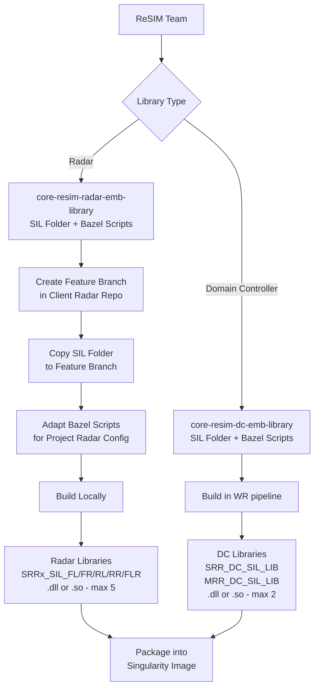
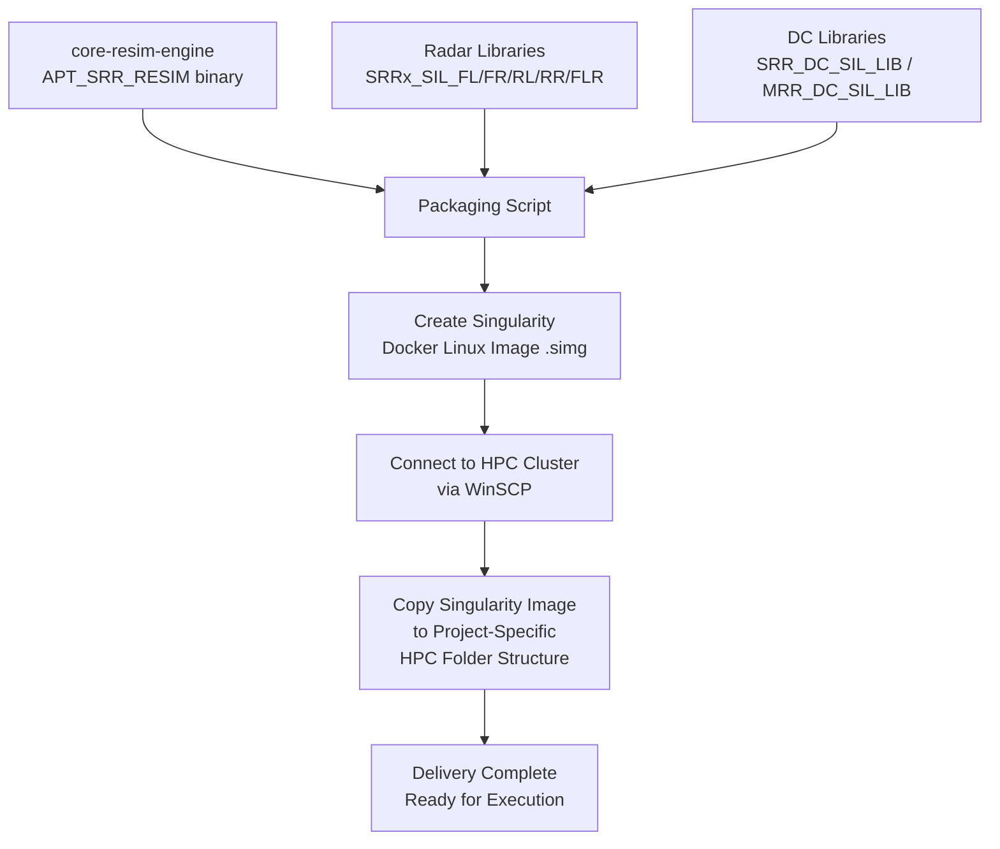
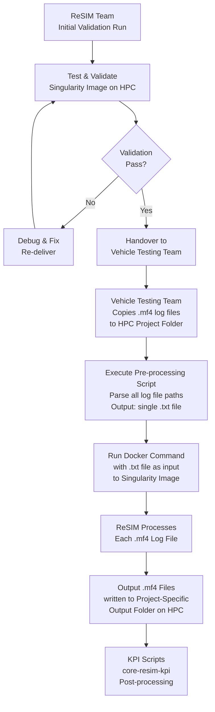
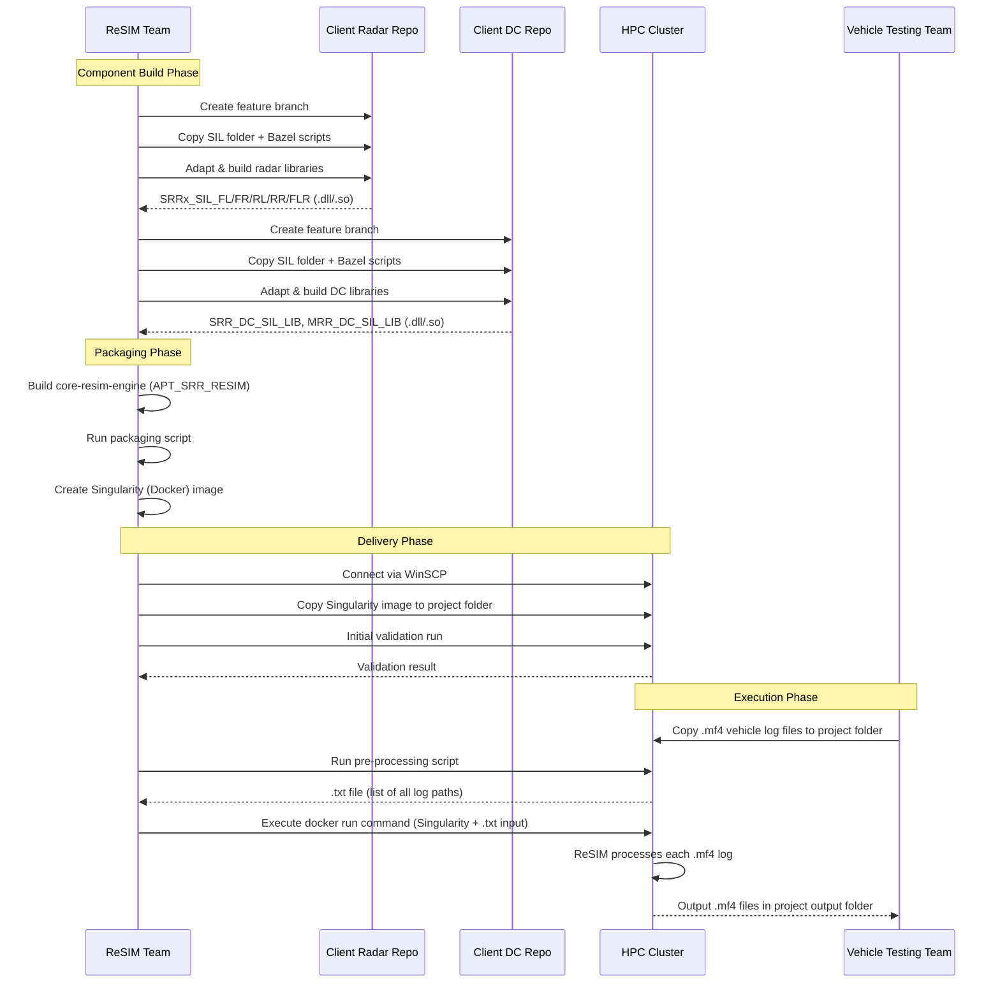

# ReSIM Current Model

**Document Version:** 1.0  
**Date:** May 21, 2026  
**Status:** Active

---

## Table of Contents

1. [Overview](#1-overview)
2. [Repository List](#2-repository-list)
3. [Component Architecture](#3-component-architecture)
4. [Component Build Process](#4-component-build-process)
5. [Embedded Library Build Flow](#5-embedded-library-build-flow)
6. [Project Delivery Flow](#6-project-delivery-flow)
7. [ReSIM Execution Flow](#7-resim-execution-flow)
8. [End-to-End Sequence Diagram](#8-end-to-end-sequence-diagram)
9. [Library Output Summary](#9-library-output-summary)
10. [Summary](#10-summary)

---

## 1. Overview

**ReSIM** (Re-Simulation) is a simulation framework used to replay vehicle testing logs through embedded radar and domain controller (DC) algorithms in a software-in-the-loop (SIL) environment. It enables re-processing of real-world vehicle log data (`.mf4` format) on High Performance Computing (HPC) clusters using containerized (Singularity/Docker) images.

The system is composed of:
- A **core simulation engine** (executable binary)
- **Embedded radar and domain controller libraries** (project-specific, compiled from client code)
- **Utility and support repositories** (Bordnet tools, HPC scripts, KPI scripts)
- A **Virtual VV (Verification & Validation) engine** variant for virtual log replay

---

## 2. Repository List

### 2.1 Core ReSIM Component Repositories

| # | Repository Name | Description | Output |
|---|----------------|-------------|--------|
| 1 | `core-resim-engine` | Main ReSIM executable binary | `APT_SRR_RESIM` (.exe / Linux binary) |
| 2 | `core-resim-radar-emb-library` | Embedded radar library used by ReSIM; project-specific | Up to 5 `.dll` / `.so` files |
| 3 | `core-resim-dc-emb-library` | Embedded domain controller library; project-specific | Up to 2 `.dll` / `.so` files |
| 4 | `core-resim-udp-decoder-library` | Standalone UDP decoder library used by ReSIM engine | `.dll` / `.so` |

### 2.2 Core Virtual ReSIM Component Repositories

| # | Repository Name | Description |
|---|----------------|-------------|
| 1 | `core-resim-vv-engine` | Main ReSIM executable binary for virtual log replay |
| 2 | `core-resim-logic-model` | Contains sensor algorithm logic libraries |
| 3 | `core-resim-sensor-model` | virtual radar sensor model |

### 2.3 Bordnet Utility Repositories

> **Note:** Bordnet runs as a **standalone Singularity image**, separate from the ReSIM Singularity image. It is used as a **preliminary evaluation tool** to analyze and verify the quality of vehicle testing logs **before running ReSIM**.

| # | Repository Name | Description | Output |
|---|----------------|-------------|--------|
| 1 | `core-resim-bordnet-tool` | Produces the Bordnet utility executable | Bordnet executable |
| 2 | `core-resim-bordnet-decoder-library` | Produces Bordnet decoder library; packaged in the standalone Bordnet Singularity image | `.dll` / `.so` |

### 2.4 Utility Script Repositories

| # | Repository Name | Description |
|---|----------------|-------------|
| 1 | `core-resim-hpcc` | Execution scripts for HPC cluster runs |
| 2 | `core-resim-kpi` | Post resim output evaluation against the input - KPI utility scripts |

### 2.5 Planned / Not Yet Implemented

| # | Repository Name | Status |
|---|----------------|--------|
| 1 | `core-resim-hil-engine` | Empty — HIL engine not yet implemented |

---

## 3. Component Architecture

```
┌─────────────────────────────────────────────────────────────────┐
│                      ReSIM Singularity Image                    │
│                                                                 │
│  ┌─────────────────────┐    ┌────────────────────────────────┐  │
│  │  core-resim-engine  │    │   Embedded Libraries           │  │
│  │  (APT_SRR_RESIM)    │◄───┤                                │  │
│  │  Main Executable    │    │  Radar:                        │  │
│  └─────────────────────┘    │   SRRx_SIL_FL  SRRx_SIL_FR     │  │
│                             │   SRRx_SIL_RL  SRRx_SIL_RR     │  │
│                             │   SRRx_SIL_FLR                 │  │
│                             │                                │  │
│                             │  Domain Controller:            │  │
│                             │   SRR_DC_SIL_LIB               │  │
│                             │   MRR_DC_SIL_LIB               │  │
│  ┌─────────────────────┐    └────────────────────────────────┘  │
│  │  UDP Decoder Lib    │                                        │
│  │                     │                                        │
│  └─────────────────────┘                                        │
└─────────────────────────────────────────────────────────────────┘
```

---

## 4. Component Build Process

### 4.1 `core-resim-engine` Build

```
┌────────────────────────────────────────────────────┐
│             core-resim-engine                      │
│                                                    │
│  1. Self-contained build scripts (no dependencies) │
│  2. Run build command locally                      │
│  3. Produces:                                      │
│     ├── Windows: APT_SRR_RESIM.exe  (for local)    │
│     └── Linux:   APT_SRR_RESIM (binary)(project)   |
|     (CMAKE --> MSBuild for windows | GCC for Linux)│
└────────────────────────────────────────────────────┘
```

**Steps:**

| Step | Action | Notes |
|------|--------|-------|
| 1 | Clone `core-resim-engine` | Self-contained repo |
| 2 | Run build command locally | Cross-platform: Windows & Linux |
| 3 | Collect output binary | `APT_SRR_RESIM` |

---

### 4.2 `core-resim-radar-emb-library` Build 
This common library repo is currently empty . Work in progress to create common SIL base for radars

**Steps:**

| Step | Action | Notes |
|------|--------|-------|
| 1 | Create feature branch in **client project's radar embedded code repo** | ReSIM team action |
| 2 | Copy `SIL` folder (from `core-resim-radar-emb-library`) to feature branch | Contains Bazel build scripts & dependencies |
| 3 | Adapt Bazel scripts for client project radar features | ReSIM team adapts based on radar gen & config |
| 4 | Build locally | Produces `.dll` (Windows) or `.so` (Linux) |
| 5 | Collect up to 5 library outputs | See table below |

**Radar Library Outputs:**

| Library Name | Description | Radar Generation |
|-------------|-------------|-----------------|
| `SRRx_SIL_FL` | Front-Left radar library | x=7 → Gen 7, x=8 → Gen 8 |
| `SRRx_SIL_FR` | Front-Right radar library | x=7 → Gen 7, x=8 → Gen 8 |
| `SRRx_SIL_RL` | Rear-Left radar library | x=7 → Gen 7, x=8 → Gen 8 |
| `SRRx_SIL_RR` | Rear-Right radar library | x=7 → Gen 7, x=8 → Gen 8 |
| `SRRx_SIL_FLR` | Front-Long-Range radar library | x=7 → Gen 7, x=8 → Gen 8 |

> **Note:** `x` in `SRRx` denotes the radar generation (7 = Gen 7, 8 = Gen 8). The number of libraries is configurable per project (max 5).

---

### 4.3 `core-resim-dc-emb-library` Build

**Steps:**

| Step | Action | Notes |
|------|--------|-------|
| 1 | Common repo for DC library | application to all projects |
| 2 | Build pipeline in WR | `.so` (Linux) |
| 3 | Collect up to 2 library outputs | See table below |

**Domain Controller Library Outputs:**

| Library Name | Description | Radar Type |
|-------------|-------------|------------|
| `SRR_DC_SIL_LIB` | Domain Controller library for Side Radars | SRR (Short Range Radar) |
| `MRR_DC_SIL_LIB` | Domain Controller library for Front Radars | FLR (Front Long Range) |

---

## 5. Embedded Library Build Flow



---

## 6. Project Delivery Flow



**Delivery Steps:**

| Step | Action | Tool/Method |
|------|--------|-------------|
| 1 | Build all required components | Local build scripts |
| 2 | Run packaging script | Singularity/Docker script |
| 3 | Bundle: engine + radar libs + DC libs | Docker image creation |
| 4 | Connect to HPC cluster | WinSCP |
| 5 | Copy Singularity image to project-specific HPC folder | WinSCP file transfer |

---

## 7. ReSIM Execution Flow



**Execution Steps:**

| Step | Actor | Action | Input | Output |
|------|-------|--------|-------|--------|
| 1 | ReSIM Team | Initial test & validation run | Singularity image | Validation result |
| 2 | Vehicle Testing Team | Copy vehicle log files to HPC | Raw vehicle logs | `.mf4` files in HPC project folder |
| 3 | ReSIM/User | Run pre-processing script | HPC folder with `.mf4` files | Single `.txt` file with all log paths |
| 4 | ReSIM/User | Execute Docker run command | `.txt` file + Singularity image | Simulation triggered |
| 5 | ReSIM Engine | Process each log file | `.mf4` input logs | `.mf4` output results |
| 6 | KPI Team | Run KPI scripts | `.mf4` output results | KPI metrics |

---

## 8. End-to-End Sequence Diagram



---

## 9. Summary

| Phase | Key Activity | Responsible | Tools Used |
|-------|-------------|-------------|------------|
| **Build — Engine** | Build ReSIM executable (`APT_SRR_RESIM`) | ReSIM Team | Local build scripts (Windows/Linux) |
| **Build — Radar Libs** | Create feature branch, copy SIL, adapt Bazel, build | ReSIM Team | Bazel, client radar repo |
| **Build — DC Libs** | Create feature branch, copy SIL, adapt Bazel, build | ReSIM Team | Bazel, client DC repo |
| **Packaging** | Bundle all components into Singularity/Docker image | ReSIM Team | Docker/Singularity script |
| **Delivery** | Transfer image to HPC project folder | ReSIM Team | WinSCP |
| **Validation** | Initial test run on HPC | ReSIM Team | HPC cluster, Singularity |
| **Log Upload** | Copy vehicle `.mf4` logs to HPC folder | Vehicle Testing Team | WinSCP / HPC access |
| **Pre-processing** | Parse log paths into a single `.txt` file | ReSIM/User | `core-resim-hpcc` scripts |
| **Execution** | Run Singularity image with `.txt` input | ReSIM/User | Docker run command |
| **Output** | `.mf4` output files written to project output folder | ReSIM Engine | HPC cluster |
| **KPI Analysis** | Post-processing of output results | KPI Team | `core-resim-kpi` scripts |

---

*Document generated from ReSIM-working.md source notes — May 21, 2026*
