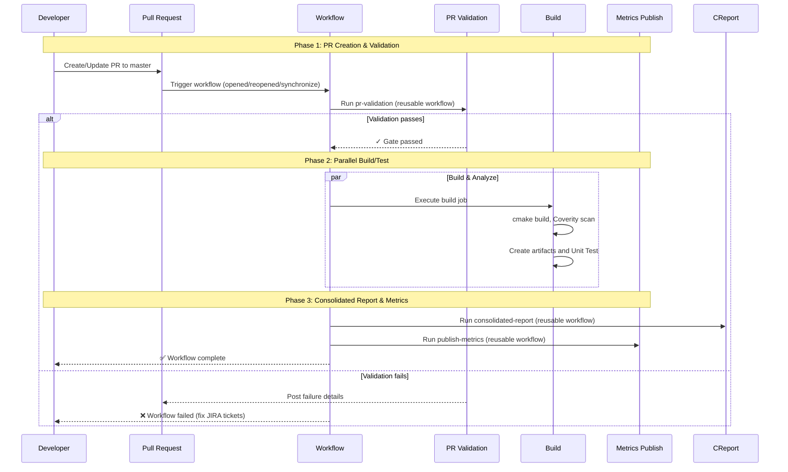
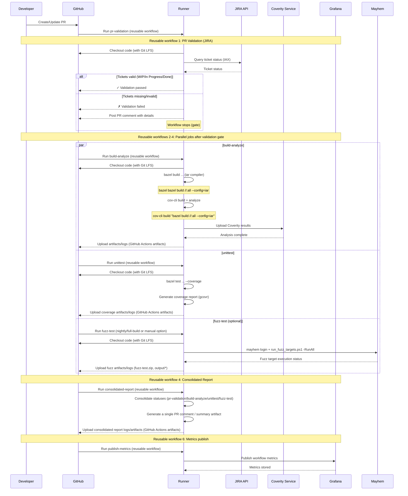
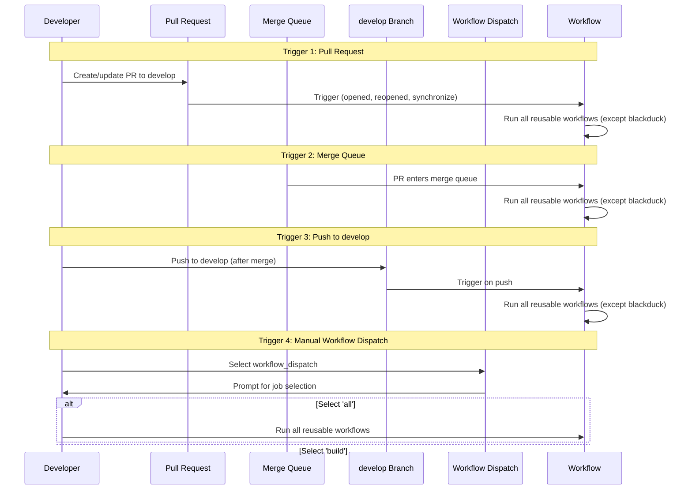
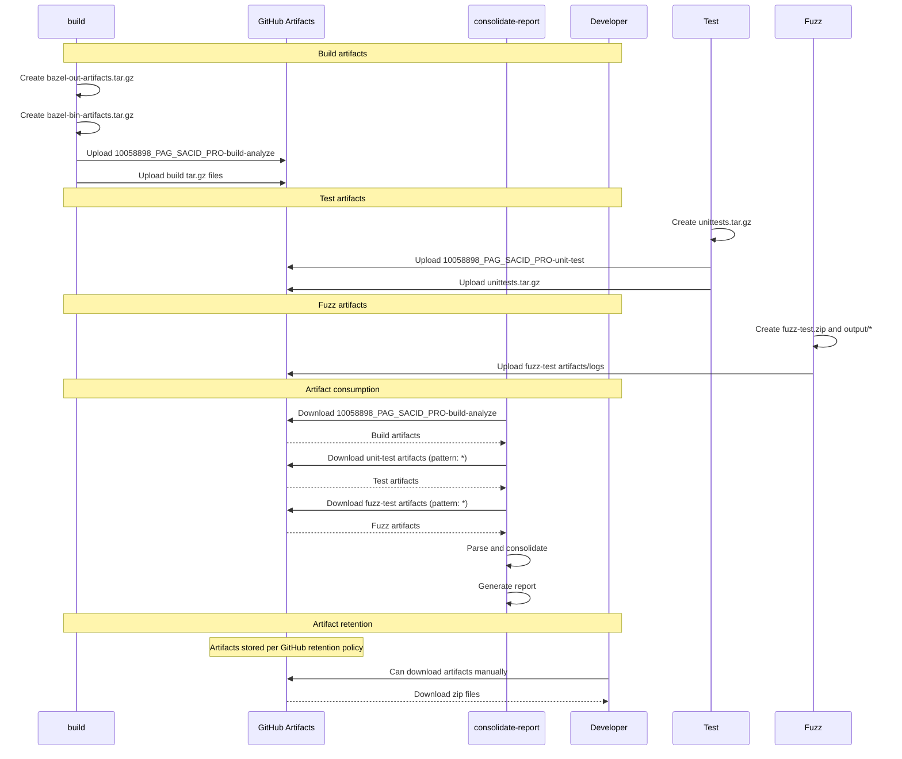

# core-resim-engine Data Flow

This document contains sequence diagrams that illustrate the data flow and processes in the core-resim-sensor-model CI/CD workflow.

## Project Overview

**Repository:** `GPO\core-resim-sensor-model`

**Team:** AZ-GTE-GPO-RESIM-DEVELOPER (TODO: confirm team name)

**Platform:** linux (Cmake build system with MSVC compiler)

**Grafana Project Key:** `NIL`(TODO: confirm team name)

**Gerrit Project:** https://gitgerrit.asux.aptiv.com/admin/repos/Core_RESIM_Sensor_Model,general

**Confluence link:** https://confluence.asux.aptiv.com/spaces/CInD/pages/757183955/RESIM+-+WR+Integration+Plan

**Components:**
- SM2 Sensor Model (core codebase)
- SM2 FMU (Functional Mock-up Unit package)
- SM2 DLL (dynamic library build)
- SM Interface executable (SMiface.exe)
- CMake-based build system
- Visual Studio 2019 Build Tools (MSVC toolchain)
- Dependent libraries:
   - OpenSimulationInterface v3.5.0
   - Protobuf v3.6.1
   - Eigen v3

## Dependencies / Tools

| Category | Dependency / Tool | Version |
|---|---|---|
| Base OS | Ubuntu | 18.04.6 LTS (Bionic Beaver)"|
| Core Utilities | curl | Latest |
| Core Utilities | wget | Latest |
| Core Utilities | git | Latest |
| Core Utilities | git-lfs | Latest |
| Build Toolchain | MSVC |
| Python Toolchain | pyenv | 3.1.1 |
| Python Toolchain | Python | 3.6.9 |
| Python Toolchain | pip | Enterprise configured |
| Python Toolchain | wheel | Latest |
| Python Toolchain | py7zr | Latest |
| Artifact Repos | pip config (JFrog) | Custom endpoints |
| Bazel Tooling | cmake | 3.28.4 |
| Credentials | git-credential-netrc | Custom |
| Credentials | .netrc | Custom |

> Note: Jobs run directly on self-hosted runners. No job containers / container images are used.

## Overall Flow (High-Level)
This diagram shows the main phases of the  workflow:

---

## Detailed Technical Flow

This diagram shows a more complete technical view (jobs, decision points, and external integrations):

---

## Workflow Triggers

This diagram shows the different trigger mechanisms and their behavior:

## Artifact Flow

This diagram shows how artifacts are created, uploaded, and consumed:

Key behavior from run traton-srr6plust-asp3-973:

- Execution gate: runs for pipeline-type=full-build with trigger-event=nightly (or empty/default) and pipeline-option including all or fuzz-test.
- Runtime: mayhem login succeeds, then run_fuzz_targets.ps1 -RunAll executes all configured fuzz targets.
- Observed targets from logs: Alignment and DataSetManager harness packages.
- Artifacts: task uploads fuzz-test.zip plus /workspace/repo/output/* in post-actions.
        
                       
    

### Trigger Events
- **Pull Request Events**: `opened`, `reopened`, `synchronize`
- **Target Branches**: `master`
- **Push Events**: Direct pushes to `master` *(no jobs run)*

### Runner & Environment
- **Primary Compute**: `linux-2-cpu-8g` (2 CPU, 8GB RAM)
- **Container**: linux containers with resource limits
- **Execution Model**: Direct execution on self-hosted runners (no job containers/images)
- **Workspace**: `C:\workspace`
- **Thread Count**: Configurable per task (build: 16, test: 4)
- **Build Cache**: Aptiv Rapid Build multi-region shared cache

### Quality Gates
1. **JIRA Validation**: Tickets must exist and be in valid status *(WIP/In Progress/Done)*
2. **Build Success**: `build` must complete successfully
3. **Code Coverage**: Minimum 80% threshold
4. **Static Analysis**: Coverity must pass
5. **Compiler Warnings**: Analyzed and reported

### Secrets & Authentication
- **JIRA_TOKEN**: JIRA API authentication for ticket validation
- **JFROG_USERNAME/PASSWORD**: JFrog Artifactory access (dependencies only; no artifact publishing)
- **APP_ID/APP_PRIVATE_KEY**: GitHub App authentication for enhanced API access and permissions

### Compute Resources

| Resource Name | Specification | Usage |
|---|---|---|
| linux-2-cpu-8g | 2 CPU, 8GB RAM | Primary build/analysis tasks |

### Container Configurations

| Container Type | Resource Specification | Purpose |
|---|---|---|
| linux-2-cpu-8g | 2 CPU, 8GB RAM, 150GB disk | Default container |
| asp-container-2c8g50g | 2 CPU, 8GB RAM, 50GB disk | Small Linux tasks |

---

### Bazel Cache Comparison (Before vs After Rapid Build)--------

| Process | Before Rapid Build (No Bazel Cache Optimization) | After Rapid Build (Bazel Cache Enabled) | Notes |
|---|---|---|---|
| Build process | ~48 min to 1 hr 15 min | ~15 min to 25 min | Pod allocation time (~15 min to 50 min) excluded from these ranges |
| Coverity build process | More than 2 hr (includes pod allocation) | ~1 hr 15 min to 2 hr | Statistics are based on build and Coverity process analysis |

**Test pipeline reference:** https://389177498442.awsaptiv.com/plm/view/sacid-pro-asp3-test-build/workflow

## Pain Point Comparison

## Gerrit vs GitHub — Pain Point Comparison

| Area | Gerrit (Pain Points) | GitHub (Strengths) |
|------|---------------------|-------------------|
| Workflow flexibility | Rigid review‑before‑submit enforced | Configurable via branch protections |
| Code review UX | Dated, dense UI | Modern, clean interface |
| Review semantics | Label-based (+1, +2) | Approve / Request changes |
| Change updates | Multiple patch sets per change | Single evolving PR |
| Comment context | Often lost across patch sets | Automatically preserved |
| Reviewer effort | High for iterative changes | Lower and in-built Github copilot review system |
| CI/CD integration | External systems required | Built-in GitHub Actions |
| CI feedback | Indirect and fragmented | PR integration |
| Security & Compliance Features | Weak integration of codequality and secret scannig | In built  Dependabot, Secret scanning, CodeQL |
| Permission model | Very granular but complex | Simple, predictable roles |
| Cross-team collaboration | Friction-heavy | Seamless |
| Build Summary | Not Native | Native summary via GitHub Actions job view | 
| Quality metrics summary | Requires custom plugins or bots | readable tabular summaries in PR checks |
| Test results visibility | External (CI UI or manual links) | Native test summary in PR |
| Ease of Use | Intricate & complex  | Intuitive & straight forward |

## Contact and Support

**Repository:** `Core_RESIM_Sensor_Model`

**CI/CD Support:** *(TODO: add owning team / DevSecOps contact)*

---

**Document Version:** 1.0
**Last Updated:** June 25, 2026
