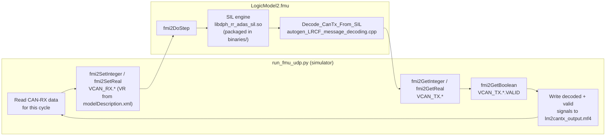

# LogicModel2 — STLA Small LM2 FMU

**Aptiv** | STLA Small Platform | FMI 2.0 Co-Simulation

---

## Overview

LogicModel2 is an FMI 2.0 Co-Simulation FMU that implements the **LRCF (Long-Range Camera Fusion)** algorithm interface for the STLA Small vehicle platform.  
It runs on a **dSPACE SCALEXIO** real-time processing unit and exchanges data via:

- **CAN (FD15)** — 539 signals across RX and TX messages, auto-generated from DBC
- **Ethernet** — single raw frame per step using a 64-bit pointer-triplet mechanism

The FMU is built for **linux64** (SCALEXIO target) and optionally for **win64** (desktop simulation).

---

## Repository Structure

```
STLA_Small_LM2/
├── Development/
│   ├── fmu/                        # FMU source, build scripts, tooling
│   │   ├── Code/                   # FMU source + generated code (compiled by CMake)
│   │   │   ├── LogicModel2.cpp     # Algorithm adapter — decodes real CAN-TX signals from the embedded LRCF/SIL library
│   │   │   ├── LogicModel2.h       # ETH frame structs, CAN-TX message-ID enum, step function declaration
│   │   │   ├── generated_signal_map.cpp  # Auto-generated FMI get/set + DoStep dispatcher (incl. fmi2GetBoolean for CAN-TX VALID flags)
│   │   │   ├── generated_structs.h       # Auto-generated CAN RX/TX/VALID C structs
│   │   │   ├── modelDescription.xml      # Auto-generated FMU variable catalogue
│   │   │   ├── fmi2Functions.h     # FMI 2.0 standard header (unmodified)
│   │   │   ├── autogen_LRCF_definition.h            # Embedded LRCF library: message/decoder class declarations
│   │   │   ├── autogen_LRCF_message_decode_types.h  # Embedded LRCF library: decoded (physical) signal structs
│   │   │   ├── autogen_LRCF_message_decoding.cpp    # Embedded LRCF library: raw→physical signal decode logic
│   │   │   ├── autogen_LRCF_message_encoded_types.h # Embedded LRCF library: raw (bit-packed) CAN message structs
│   │   │   ├── autogen_LRCF_signal_macros.h         # Embedded LRCF library: signal encode/decode bit macros
│   │   │   ├── fixmac.h            # Support header required by the embedded SIL/LRCF library
│   │   │   ├── CMakeLists.txt      # Cross-platform CMake build (Linux + Windows)
│   │   │   ├── 2025Q3_STLA_Brain_V1_2025_10_16_LRCF_LRCF_SW6_1_V12.1_RCTA_LKA_STATE.dbc    # Source DBC file(s) used for code generation
│   │   │   └── Version.cpp/.h
│   │   ├── Scripts/                # Build & tooling scripts
│   │   │   ├── dbc_to_fmi_generator.py # Generator: DBC → generated_*.cpp/h + modelDescription.xml (now emits CAN-TX VALID flags)
│   │   │   ├── run_fmu_udp.py      # UDP-driven FMU runner/test harness
│   │   │   ├── validate_lrcf_fmu.py    # 4-step FMU validation suite
│   │   │   ├── fmu_viewer.py       # Inspect FMU variable list
│   │   │   └── build.sh / build.bat    # Convenience build scripts (Linux/Windows)
│   │   ├── ExternalLibs/           # Embedded SIL library headers + prebuilt libs
│   │   └── Build/                  # CMake build output incl. LogicModel2.fmu (do not commit — generated artefact)
│   └── config/
│       └── transmission_config.json
├── CustomFunctions/
│   ├── FmuEthBridge/               # dSPACE SCALEXIO Custom Function (Ethernet bridge)
│   │   ├── FmuEthBridge.xml
│   │   ├── FmuEthBridge.h
│   │   ├── FmuEthBridge.cpp
│   │   ├── FmuEthBridge_TypeDef.h
│   │   └── README.txt
│   ├── ZMQ.*                       # ZeroMQ Custom Function (reference, not used by FMU)
│   └── CustomEthSetup.*            # dSPACE Custom Ethernet Setup CF (reference)
└── Delivery/                       # Customer delivery zips (do not commit large binaries)
```

---

## Quick Start — Build

### Prerequisites

| Tool | Version | Purpose |
|---|---|---|
| g++ / MSVC | C++14 | Compile FMU shared library |
| CMake | ≥ 3.14 | Cross-platform build |
| Python 3 | ≥ 3.8 | Code generation + validation |
| cantools | `pip install cantools` | DBC parsing |
| fmpy | `pip install fmpy` | FMU validation |

### Linux (SCALEXIO target)

```bash
cd Development/fmu

# One-step build + validate
bash build.sh --validate

# OR via CMake
cmake -S . -B build
cmake --build build
cmake --build build -t validate
```

### Windows

```cmd
cd Development\fmu

cmake -S . -B build -G "Visual Studio 17 2022" -A x64
cmake --build build --config Release
```

Output is `Development/fmu/LogicModel2.fmu` in both cases.

### Build Options

| CMake cache variable | Default | Description |
|---|---|---|
| `DBC_FILE` | `JOB3_LRCF_FD_CAN15.dbc` | Source DBC file |
| `FMU_NODE` | `LRCF` | DBC node name for CAN TX signal filtering |

---

## FMU Variable Summary

| Group | Count | Variable references |
|---|---|---|
| Parameters | 11 | VR 100–115 |
| CAN RX (Integer) | 231 | VR 1000+ |
| CAN RX (Real) | 73 | VR 1000+ |
| CAN TX (Integer) | 244 | VR 1000+ |
| CAN TX (Real) | 212 | VR 1000+ |
| CAN TX VALID flags (Boolean) | 11 | VR 3000–3010  (`VCAN_TX.<msg>.VALID`) |
| ETH RX pointer | 3 | VR 5000–5002  (`EthRxIn.lo/hi/size`) |
| ETH TX pointer | 3 | VR 5003–5005  (`EthTxOut.lo/hi/size`) |
| **Total** | **788** | |

Each CAN-TX message now exposes a companion `VCAN_TX.<MessageName>.VALID` Boolean output (read via `fmi2GetBoolean`) indicating whether that message was actually produced by the algorithm during the current step.

---

## SCALEXIO Integration

See `CustomFunctions/FmuEthBridge/README.txt` for the complete ConfigurationDesk setup guide.

**One-block setup:**
1. Add `FmuEthBridge` Custom Function to the CD project
2. Assign RX/TX Ethernet hardware ports under **Electrical Interface → Hardware Assignment**
3. Set 8 parameters (ports, IPs, subnet masks)
4. Wire 6 scalar Int32 DataPorts to FMU ETH Integer variables (VR 5000–5005)
5. Wire CAN RX/TX signals to FMU variables via auto-wiring (VCAN_RX / VCAN_TX prefix)

---

## Algorithm Integration

The CMake build in `Development/fmu/Code` compiles `LogicModel2.cpp` together with the required embedded libraries in (`ExternalLibs/Libs`) into a single FMU — the shared library is packaged inside the FMU's `binaries/<platform>/` folder so the FMU is fully self-contained. The FMU exposes CAN-RX, CAN-TX and CAN-TX-VALID signals as FMI variables (catalogued in `modelDescription.xml`), which is the contract used to drive it.

`Development/fmu/Scripts/run_fmu_udp.py` acts as the simulator/master driving this FMU:

1. **CAN-RX in** — for each simulation step, the script sets the exposed `VCAN_RX.*` variables (via `fmi2SetInteger` / `fmi2SetReal`, using the value references read from `modelDescription.xml`) with the CAN-RX data for that cycle.
2. **Step the SIL engine** — the script calls `fmi2DoStep`. Inside the FMU, `LogicModel2.cpp` forwards the input signals into the packaged SIL engine's exposed API and runs one algorithm cycle.
3. **CAN-TX decode** — after the cycle, `Decode_CanTx_From_SIL()` scans the SIL engine's DVL CAN-FD payload output (`sil_output.dvl_payload_out`) for each known LRCF CAN-TX message ID (`FD15_LRCF_DATA_2` … `FD15_LRCF_DATA_11`, `FD15_FLT_EVT_LRCF`, etc., declared in `LogicModel2.h`). Matching raw payloads are copied into the auto-generated encoded-type structs (`autogen_LRCF_message_encoded_types.h`) and decoded into physical signal values via the generated `LRCF::Decode_Signal_values_for_Message_*()` routines (`autogen_LRCF_message_decoding.cpp`).
4. **CAN-TX out** — decoded signals are copied field-by-field into the FMU's `FMU_CAN_TX_t` output struct (`fmu_tx`) and exposed as `VCAN_TX.*` FMI variables, read back by the script via `fmi2GetInteger` / `fmi2GetReal`.
5. **Valid flags** — a companion `FMU_CAN_TX_VALID_t` flag is set per message so the script can tell whether that CAN-TX message was actually produced by the algorithm this step (exposed as `VCAN_TX.<msg>.VALID`, read via `fmi2GetBoolean`).
6. **MF4 logging** — the script collects the decoded `VCAN_TX.<Msg>.<Sig>` values (gated by their VALID flags) across all steps and writes them to `lm2cantx_output.mf4`.
7. **ETH** — the incoming Ethernet frame (RX pointer-triplet) is fed into the same SIL engine call as the CAN cycle, the Ethernet output frame(s) are queued and drained one per step onto the TX pointer-triplet.

The `autogen_LRCF_*` files under `Code/` are generated from the LRCF DBC by the embedded library toolchain (not by `dbc_to_fmi_generator.py`) and are compiled directly into the FMU via `CMakeLists.txt`.


